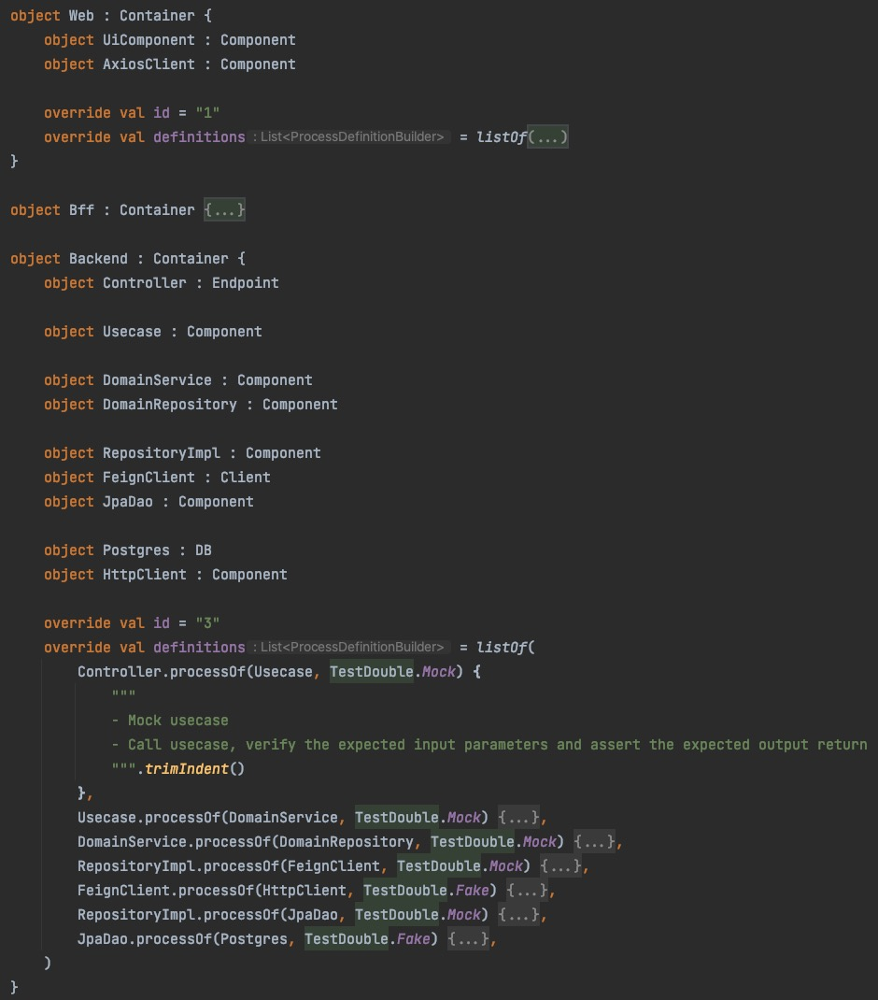
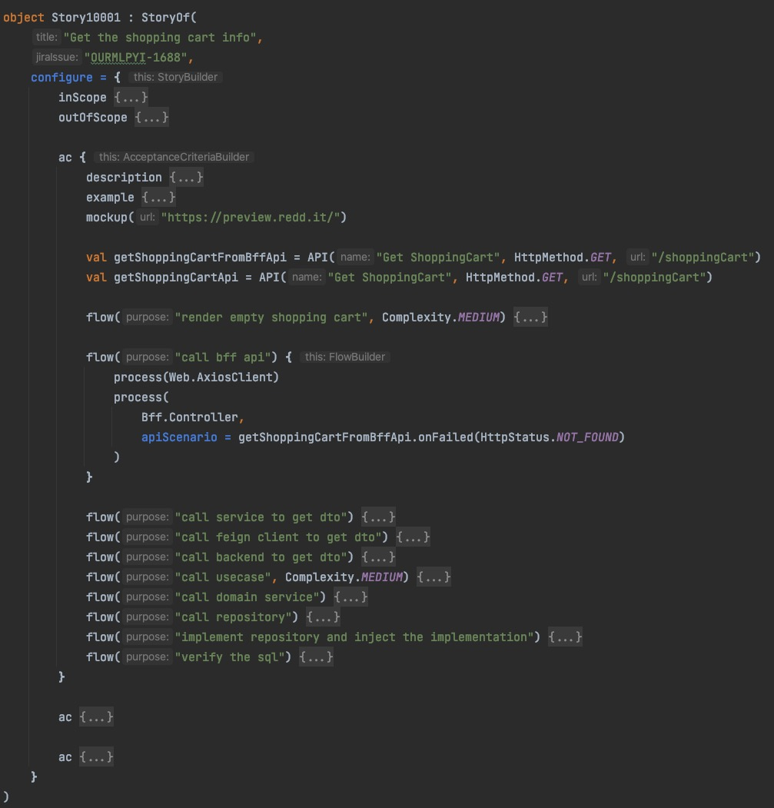
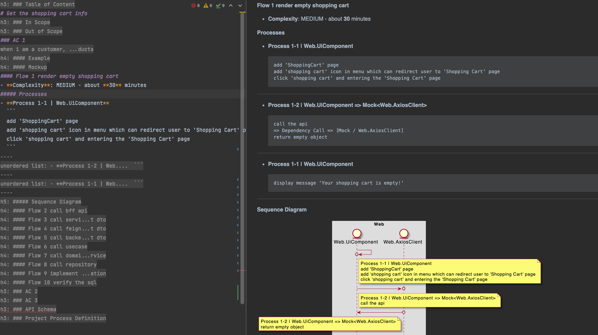
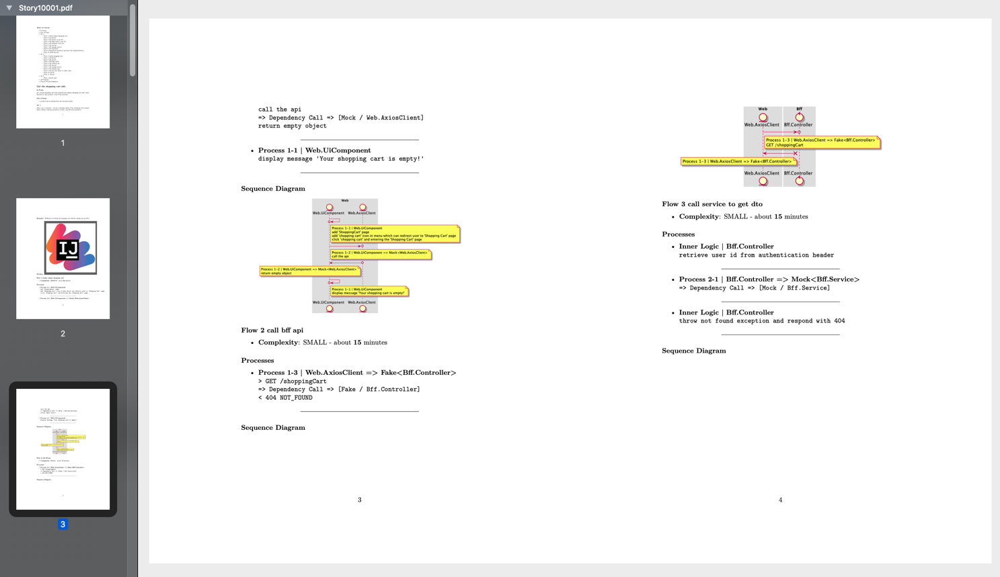

[TOC]

# 黑马工序小助手

## Key Benefits

- 利用IDE的提示和纠错，提高书写效率
- 利用代码的抽象和复用，提高书写效率
- 自动扫描并组合api schema，统一显示api定义
- 自动扫描并组合时序图，按组件的架构层级展示链路调用关系
- 输出单一PDF方便阅读
- 支持上传到jira
- 架构分层(Node) + 工序定义(Process) + 流程描述(Flow) + 工序编排(FlowProcess) + DSL描述调用关系 => 时序图，巨量提升可读性

## Features

- [x] 在时序图中显示api schema
- [x] 输出成markdown文件
- [x] 输出成pdf带时序图
- [x] 上传pdf到jira附件
- [x] 同步修改jira卡
- [x] 使用plantuml实现时序图
- [x] 使用时序图样式优化调用关系的表述
- [x] 优化dsl结构
- [x] 配置文件
- [x] 多项目支持(配置、路径、)
- [x] 工序预定义
- [x] 工序定义优化显示
- [x] 效能追踪（时间
- [x] 使用infix函数改造process的声明方式(A->B)
- [x] 效能报告输出
- [x] 根据git diff自动输出修改的story、architecture、performance

### Backlogs

- [ ] 效能报告优化 - excel
- [ ] 集中显示api schema 合并AC中的时序图（按不同层级进行合并）(低优先级)
- [ ] 生成对应的测试报告
- [ ] 插件化 - idea代码模板
- [ ] 插件化 - idea生成快捷键
- [ ] 插件化 - idea codegen
- [ ] ~~CI/CD commit 自动化生成~~ 暂无好的方案

### Issues

- pdf不支持中文

----

## How to start

### 初始化项目配置

- 在 `resources/projects.properties` 中添加项目名

```properties
projects=order,<your project name>
```

- 创建项目配置 `resources/projects/<your project name>/configure.properties` 并按如下规则写入配置信息

```properties

# ------
# [REQUIRED] 打印选项 = PrintOption
# MARKDOWN_TYPORA               生成markdown+typora时序图
# MARKDOWN_TYPORA_PLANTUML      生成markdown+plantuml时序图
# PDF_PLANTUML                  生成markdown+pdf+plantuml时序图
# JIRA_ATTACHMENT               生成markdown+pdf+plantuml时序图, 并上传jira
printer=MARKDOWN_TYPORA
# ------
# [OPTIONAL, default = empty] 隐藏部分信息
hidden=complexity
# ------
# [OPTIONAL, default = flow] 效能计算, 以flow/process为粒度进行计算
cost_algorithm=flow
# ------
# 如果要上传jira, 需要配置server地址和access token
#jira_baseurl=https://jira.xxx.xxx.com/rest/api/2
#jira_token=*************************
```

- 创建项目工作路径 `com/thoughtworks/projects/<your project name>`

> 生成时会按`<your project name>`来寻找配置, 需要保证这个别名是一个词

### 定义项目工序

- 创建项目架构描述, 定义系统、进程、进程内的组件模块(参考:`com/thoughtworks/projects/order/ProjectArchitecture.kt`)

```
object xxx : Container {                        // 应用进程
    object xxx1 : Component                     // 组件1
    object xxx2 : Component                     // 组件2
    
    override val id = "1"                       // 进程编号
    override val definitions = listOf(...)      // 工序定义
}
```  

### 编写故事工序

- 创建Story

```
object StoryName : StoryOf(
    val title: String,                          // 标题
    val jiraIssue: String? = null,              // jira 卡号
    val configure: StoryBuilder.() -> Unit,     // 配置DSL
)

fun main() {
    Story10001.print()                          // BOOM!!! It's done~
}
```

#### DSL功能

见 `com/thoughtworks/projects/order/Story-1001.kt`

```
inScope { 文字描述 }
outOfScope { 文字描述 }
ac {
    description { 文字描述 }
    example { 文字描述 }
    mockup { 图片地址 }
    links { 链接地址 }
    flows ( 目的 效能指标) {
        process ( 架构节点 入参 返回 API场景) {
            // 多层依赖调用 e.g. A->B B->C C->B B-A
            process ( ... )
        } 
    }
}
```

## Demo

### + Architecture



### + Story



### = Markdown



### => PDF



##### 代码架构

- Schema 模型
    - Node 架构节点
        - Container 进程应用
            - Process 工序定义
        - Component 进程内组件
    - Story 故事卡
        - AcceptanceCriteria AC描述
        - Flow 完成AC所需要的一个或多个工作流、调用链
        - FlowProcess 组成工作流、调用链的单个工序
- Printer 打印器
    - MarkdownPrinter 输出Markdown文件
        - Typora...Formatter 按Markdown语法序列化Story
    - Plantuml 输出uml图片
        - Plantuml...Formatter 按uml语法绘制流程图
    - PandocPdfPrinter 输出pdf文件
    - JiraPrinter 输出到Jira的Issue卡中
- GlobalConfig 全局配置加载和读取
