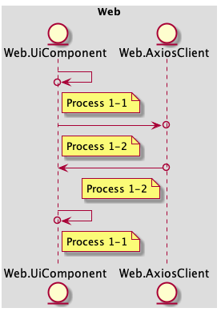
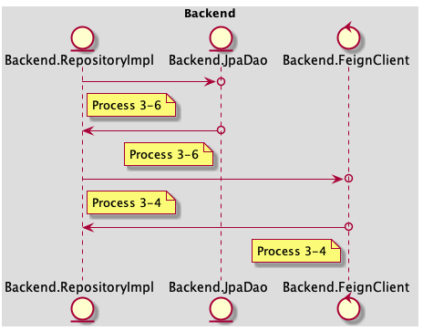
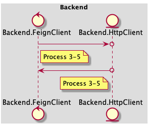

### Table of Content
- [In Scope](#in-scope)
- [Out of Scope](#out-of-scope)
- [AC 1](#ac-1)
  - [Flow 1-1 render empty shopping cart](#flow-1-1-render-empty-shopping-cart)
  - [Flow 1-2 call bff api](#flow-1-2-call-bff-api)
  - [Flow 1-3 call service to get dto](#flow-1-3-call-service-to-get-dto)
  - [Flow 1-4 call feign client to get dto](#flow-1-4-call-feign-client-to-get-dto)
  - [Flow 1-5 call backend to get dto](#flow-1-5-call-backend-to-get-dto)
  - [Flow 1-6 call usecase](#flow-1-6-call-usecase)
  - [Flow 1-7 call domain service](#flow-1-7-call-domain-service)
  - [Flow 1-8 call repository](#flow-1-8-call-repository)
  - [Flow 1-9 implement repository and inject the implementation](#flow-1-9-implement-repository-and-inject-the-implementation)
  - [Flow 1-10 verify the sql](#flow-1-10-verify-the-sql)
- [AC 2](#ac-2)
  - [Flow 2-1 render shopping cart](#flow-2-1-render-shopping-cart)
  - [Flow 2-2 call bff api](#flow-2-2-call-bff-api)
  - [Flow 2-3 call service](#flow-2-3-call-service)
  - [Flow 2-4 call feign client](#flow-2-4-call-feign-client)
  - [Flow 2-5 call backend api](#flow-2-5-call-backend-api)
  - [Flow 2-6 call usecase](#flow-2-6-call-usecase)
  - [Flow 2-7 call domain service](#flow-2-7-call-domain-service)
  - [Flow 2-8 call domain repo](#flow-2-8-call-domain-repo)
  - [Flow 2-9 call dao and client to collect data](#flow-2-9-call-dao-and-client-to-collect-data)
  - [Flow 2-10 call db](#flow-2-10-call-db)
  - [Flow 2-11 call api](#flow-2-11-call-api)
- [AC 3](#ac-3)
  - [Flow 3-1 nested calls](#flow-3-1-nested-calls)
- [API Schema](#api-schema)
- [Project Process Definition](#project-process-definition)
# Get the shopping cart info
### In Scope
get current shopping cart from backend and display shopping cart info: price, amount for each product, total of the products
### Out of Scope
- product info is getting from the external system
### AC 1
when i am a customer, 
i can see a message saying 'Your shopping cart is empty' when i haven't add any products, 
so that i can add more products
#### Example
William is reviewing his shopping cart without adding any product
#### Mockup
----

#### Flow 1-1 render empty shopping cart
- **Complexity**: MEDIUM - about **60** minutes
##### Processes
- **Process 1-1 | Web.UiComponent**
  add 'ShoppingCart' page
  add 'shopping cart' icon in menu which can redirect user to 'Shopping Cart' page
  click 'shopping cart' and entering the 'Shopping Cart' page
  
  ```typescript
  interface ShoppingCartProps {
      items: ProductDto[]
  }
  ```
  Return expected result
----
- **Process 1-2 | Web.UiComponent -> Mock<Web.AxiosClient>**
  call the api
  **Web.UiComponent -> Mock<Web.AxiosClient>**
  return empty object
----
- **Process 1-1 | Web.UiComponent**
  display message 'Your shopping cart is empty!'
  Return expected result
----
##### Sequence Diagram
> 
#### Flow 1-2 call bff api
- **Complexity**: SMALL - about **30** minutes
##### Processes
- **Process 1-3 | Web.AxiosClient -> Fake<Bff.Controller>**
  \> GET /shoppingCart
  **Web.AxiosClient -> Fake<Bff.Controller>**
  < 404 NOT_FOUND
----
##### Sequence Diagram
> 
#### Flow 1-3 call service to get dto
- **Complexity**: SMALL - about **30** minutes
##### Processes
- **Process 2-1 | Bff.Controller -> Mock<Bff.Service>**
  retrieve user id from authentication header
  **Bff.Controller -> Mock<Bff.Service>**
  throw not found exception and respond with 404
----
##### Sequence Diagram
> 
#### Flow 1-4 call feign client to get dto
- **Complexity**: SMALL - about **30** minutes
##### Processes
- **Process 2-2 | Bff.Service -> Mock<Bff.FeignClient>**
  call feign client with user id
  **Bff.Service -> Mock<Bff.FeignClient>**
  throw not found exception
----
##### Sequence Diagram
> 
#### Flow 1-5 call backend to get dto
- **Complexity**: SMALL - about **30** minutes
##### Processes
- **Inner Logic | Bff.FeignClient**
  \> GET /shoppingCart
  < 404 NOT_FOUND
----
##### Sequence Diagram
> 
#### Flow 1-6 call usecase
- **Complexity**: MEDIUM - about **60** minutes
##### Processes
- **Process 3-1 | Backend.Controller -> Mock<Backend.Usecase>**
  call usecase to find the shopping cart by user id
  **Backend.Controller -> Mock<Backend.Usecase>**
  throw not found exception and respond with 404
----
##### Sequence Diagram
> 
#### Flow 1-7 call domain service
- **Complexity**: SMALL - about **30** minutes
##### Processes
- **Process 3-2 | Backend.Usecase -> Mock<Backend.DomainService>**
  Collect request parameters
  **Backend.Usecase -> Mock<Backend.DomainService>**
  Return expected result
----
##### Sequence Diagram
> 
#### Flow 1-8 call repository
- **Complexity**: SMALL - about **30** minutes
##### Processes
- **Process 3-3 | Backend.DomainService -> Mock<Backend.DomainRepository>**
  Collect request parameters
  **Backend.DomainService -> Mock<Backend.DomainRepository>**
  Return expected result
----
##### Sequence Diagram
> 
#### Flow 1-9 implement repository and inject the implementation
- **Complexity**: SMALL - about **30** minutes
##### Processes
- **Process 3-6 | Backend.RepositoryImpl -> Mock<Backend.JpaDao>**
  implement domain repository and search shopping cart in db
  **Backend.RepositoryImpl -> Mock<Backend.JpaDao>**
  returns null
----
##### Sequence Diagram
> 
#### Flow 1-10 verify the sql
- **Complexity**: SMALL - about **30** minutes
##### Processes
- **Process 3-7 | Backend.JpaDao -> Mock<Backend.Postgres>**
  Collect request parameters
  **Backend.JpaDao -> Mock<Backend.Postgres>**
  Return expected result
----
##### Sequence Diagram
> 
### AC 2
when i am a customer,
i can see my shopping cart with the products that i added before,
so that i can review the amount and total price of them
#### Example
William is reviewing his shopping cart after added some products
#### Mockup
----

#### Flow 2-1 render shopping cart
- **Complexity**: SMALL - about **30** minutes
##### Processes
- **Process 1-2 | Web.UiComponent -> Mock<Web.AxiosClient>**
  click 'the shopping cart' icon
  **Web.UiComponent -> Mock<Web.AxiosClient>**
  receive response with shopping cart info
  display the product list and the total price
----
##### Sequence Diagram
> 
#### Flow 2-2 call bff api
- **Complexity**: SMALL - about **30** minutes
##### Processes
- **Process 1-3 | Web.AxiosClient -> Fake<Bff.Controller>**
  \> GET /shoppingCart
  Web.AxiosClient -> Fake<Bff.Controller>
  < 200 OK
----
##### Sequence Diagram
> 
#### Flow 2-3 call service
- **Complexity**: SMALL - about **30** minutes
##### Processes
- **Process 2-1 | Bff.Controller -> Mock<Bff.Service>**
  retrieve user id from authentication header
  **Bff.Controller -> Mock<Bff.Service>**
  Return expected result
----
##### Sequence Diagram
> 
#### Flow 2-4 call feign client
- **Complexity**: SMALL - about **30** minutes
##### Processes
- **Process 2-2 | Bff.Service -> Mock<Bff.FeignClient>**
  Collect request parameters
  **Bff.Service -> Mock<Bff.FeignClient>**
  Return expected result
----
##### Sequence Diagram
> 
#### Flow 2-5 call backend api
- **Complexity**: SMALL - about **30** minutes
##### Processes
- **Inner Logic | Bff.FeignClient**
  \> GET /shoppingCart
  < 200 OK
----
##### Sequence Diagram
> 
#### Flow 2-6 call usecase
- **Complexity**: SMALL - about **30** minutes
##### Processes
- **Process 3-1 | Backend.Controller -> Mock<Backend.Usecase>**
  call usecase to find the shopping cart by user id
  **Backend.Controller -> Mock<Backend.Usecase>**
  Return expected result
----
##### Sequence Diagram
> 
#### Flow 2-7 call domain service
- **Complexity**: SMALL - about **30** minutes
##### Processes
- **Process 3-2 | Backend.Usecase -> Mock<Backend.DomainService>**
  Collect request parameters
  **Backend.Usecase -> Mock<Backend.DomainService>**
  Return expected result
----
##### Sequence Diagram
> 
#### Flow 2-8 call domain repo
- **Complexity**: SMALL - about **30** minutes
##### Processes
- **Process 3-3 | Backend.DomainService -> Mock<Backend.DomainRepository>**
  Collect request parameters
  **Backend.DomainService -> Mock<Backend.DomainRepository>**
  Return expected result
----
##### Sequence Diagram
> 
#### Flow 2-9 call dao and client to collect data
- **Complexity**: SMALL - about **30** minutes
##### Processes
- **Process 3-6 | Backend.RepositoryImpl -> Mock<Backend.JpaDao>**
  
                          implement domain repository and search shopping cart in db
                          get shopping cart with product id
                   
  **Backend.RepositoryImpl -> Mock<Backend.JpaDao>**
  Return expected result
----
- **Process 3-4 | Backend.RepositoryImpl -> Mock<Backend.FeignClient>**
  get product by id
  **Backend.RepositoryImpl -> Mock<Backend.FeignClient>**
  returns shopping cart
----
##### Sequence Diagram
> 
#### Flow 2-10 call db
- **Complexity**: SMALL - about **30** minutes
##### Processes
- **Process 3-7 | Backend.JpaDao -> Mock<Backend.Postgres>**
  use h2
  **Backend.JpaDao -> Mock<Backend.Postgres>**
  Return expected result
----
##### Sequence Diagram
> 
#### Flow 2-11 call api
- **Complexity**: SMALL - about **30** minutes
##### Processes
- **Process 3-5 | Backend.FeignClient -> Mock<Backend.HttpClient>**
  use Wiremock
  **Backend.FeignClient -> Mock<Backend.HttpClient>**
  Return expected result
----
##### Sequence Diagram
> 
### AC 3
dsl demo
#### Mockup
----


#### Links
- [Google 1](https://www.google.com)
- [Google 2](https://www.google.com)
#### Flow 3-1 nested calls
- **Complexity**: SMALL - about **30** minutes
##### Processes
- **Process 1-2 | Web.UiComponent -> Mock<Web.AxiosClient>**
  click
  **Web.UiComponent -> Mock<Web.AxiosClient>**
  send request
----
- **Process 1-3 | Web.AxiosClient -> Fake<Bff.Controller>**
  \> GET /go-google
  **Web.AxiosClient -> Fake<Bff.Controller>**
  < 200 OK
----
- **Process 2-1 | Bff.Controller -> Mock<Bff.Service>**
  execute
  **Bff.Controller -> Mock<Bff.Service>**
  Return expected result
----
- **Process 2-2 | Bff.Service -> Mock<Bff.FeignClient>**
  \> GET /go-google
  **Bff.Service -> Mock<Bff.FeignClient>**
  < 200 OK
----
##### Sequence Diagram
> 
### API Schema
#### Get ShoppingCart
> GET /shoppingCart
- 200 OK
  - Response
  ```json
  {
      products: [{
          id: 10001
          name: "i'm a product",
          amount: 1,
          price: 500.00,
          total: 500.00
      }],
      total: 500.00
  }
  ```
- 404 NOT_FOUND
### Project Process Definition
#### Web
##### Process 1-1 | UiComponent => Real\<UiComponent>
- Just import related ui component, testing with snapshot
##### Process 1-2 | UiComponent => Mock\<AxiosClient>
- Mock axios client
- Call axios client, assert component state
##### Process 1-3 | AxiosClient => Fake\<Bff.Controller>
- Fake api endpoint
- Call fake api, assert the response and error handling is correct
#### Bff
##### Process 2-1 | Controller => Mock\<Service>
- Mock service
- Call service, verify the expected input parameters and assert the expected output return
##### Process 2-2 | Service => Mock\<FeignClient>
- Mock feign client
- Call feign client, verify the expected input parameters and assert the expected output return
#### Backend
##### Process 3-1 | Controller => Mock\<Usecase>
- Mock usecase
- Call usecase, verify the expected input parameters and assert the expected output return
##### Process 3-2 | Usecase => Mock\<DomainService>
- Mock domain service
- Call domain service, verify the expected input parameters and assert the expected output return
##### Process 3-3 | DomainService => Mock\<DomainRepository>
- Mock domain repository
- Call domain repository, verify the expected input parameters and assert the expected output return
##### Process 3-4 | RepositoryImpl => Mock\<FeignClient>
- Mock feign client
- Call feign client, verify the expected input parameters and assert the expected output return
##### Process 3-5 | FeignClient => Mock\<HttpClient>
- Fake http client (using wiremock)
- Call http client, stub the request and response and assert the expected response status and payload
##### Process 3-6 | RepositoryImpl => Mock\<JpaDao>
- Mock jpa dao
- Call jpa dao, verify the expected input parameters and assert the expected output return
##### Process 3-7 | JpaDao => Mock\<Postgres>
- Fake db (using h2 or docker)
- Call fake db, init some test data and assert the execution result set is expected