### Table of Content
- [In Scope](#in-scope)
- [Out of Scope](#out-of-scope)
- [AC 1](#ac-1)
  - [Flow 1-1](#flow-1-1)
  - [Flow 1-2](#flow-1-2)
  - [Flow 1-3](#flow-1-3)
  - [Flow 1-4](#flow-1-4)
  - [Flow 1-5](#flow-1-5)
  - [Flow 1-6](#flow-1-6)
  - [Flow 1-7](#flow-1-7)
  - [Flow 1-8](#flow-1-8)
  - [Flow 1-9](#flow-1-9)
  - [Flow 1-10](#flow-1-10)
- [AC 2](#ac-2)
  - [Flow 2-1](#flow-2-1)
  - [Flow 2-2](#flow-2-2)
  - [Flow 2-3](#flow-2-3)
  - [Flow 2-4](#flow-2-4)
  - [Flow 2-5](#flow-2-5)
  - [Flow 2-6](#flow-2-6)
  - [Flow 2-7](#flow-2-7)
  - [Flow 2-8](#flow-2-8)
  - [Flow 2-9](#flow-2-9)
  - [Flow 2-10](#flow-2-10)
  - [Flow 2-11](#flow-2-11)
- [AC 3](#ac-3)
  - [Flow 3-1](#flow-3-1)
- [API Schema](#api-schema)
- [Project Process Definition](#project-process-definition)
# Get the shopping cart info
### In Scope
get current shopping cart from backend and display shopping cart info: price, amount for each product, total of the products
### Out of Scope
- product info is getting from the external system
### <span id='ac-1'>AC 1</span>
when i am a customer, 
i can see a message saying 'Your shopping cart is empty' when i haven't add any products, 
so that i can add more products
#### Mockup
----

#### <span id='flow-1-1'>Flow 1-1</span>
render empty shopping cart
##### Processes
- **Process 1-1 | Web.UiComponent | 60 mins**
  add 'ShoppingCart' page
  add 'shopping cart' icon in menu which can redirect user to 'Shopping Cart' page
  click 'shopping cart' and entering the 'Shopping Cart' page
  
  ```typescript
  interface ShoppingCartProps {
      items: ProductDto[]
  }
  ```
----
- **Process 1-2 | Web.UiComponent, depends on Mock<Web.AxiosClient> | 60 mins**
  call the api
  *Web.UiComponent -> Mock<Web.AxiosClient>*
  return empty object
----
- **Process 1-1 | Web.UiComponent | 60 mins**
  display message 'Your shopping cart is empty!'
----
##### Sequence Diagram
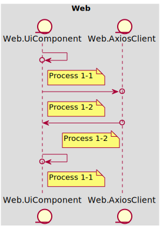
#### <span id='flow-1-2'>Flow 1-2</span>
call bff api
##### Processes
- **Process 1-3 | Web.AxiosClient, depends on Fake<Bff.Controller> | 0 mins**
  \> GET /shoppingCart
  *Web.AxiosClient -> Fake<Bff.Controller>*
  < 404 NOT_FOUND
----
##### Sequence Diagram
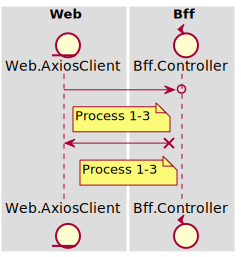
#### <span id='flow-1-3'>Flow 1-3</span>
call service to get dto
##### Processes
- **Process 2-1 | Bff.Controller, depends on Mock<Bff.Service> | 60 mins**
  retrieve user id from authentication header
  *Bff.Controller -> Mock<Bff.Service>*
  throw not found exception and respond with 404
----
##### Sequence Diagram
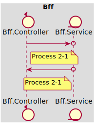
#### <span id='flow-1-4'>Flow 1-4</span>
call feign client to get dto
##### Processes
- **Process 2-2 | Bff.Service, depends on Mock<Bff.FeignClient> | 60 mins**
  call feign client with user id
  *Bff.Service -> Mock<Bff.FeignClient>*
  throw not found exception
----
##### Sequence Diagram
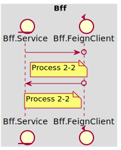
#### <span id='flow-1-5'>Flow 1-5</span>
call backend to get dto
##### Processes
- **Process 2-3 | Bff.FeignClient, depends on Fake<Backend.Controller> | 60 mins**
  \> GET /shoppingCart
  *Bff.FeignClient -> Fake<Backend.Controller>*
  < 404 NOT_FOUND
----
##### Sequence Diagram
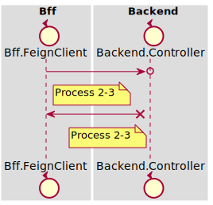
#### <span id='flow-1-6'>Flow 1-6</span>
call usecase
##### Processes
- **Process 3-1 | Backend.Controller, depends on Mock<Backend.Usecase> | 60 mins**
  call usecase to find the shopping cart by user id
  *Backend.Controller -> Mock<Backend.Usecase>*
  throw not found exception and respond with 404
----
##### Sequence Diagram

#### <span id='flow-1-7'>Flow 1-7</span>
call domain service
##### Processes
- **Process 3-2 | Backend.Usecase, depends on Mock<Backend.DomainService> | 60 mins**
  
----
##### Sequence Diagram

#### <span id='flow-1-8'>Flow 1-8</span>
call repository
##### Processes
- **Process 3-3 | Backend.DomainService, depends on Mock<Backend.DomainRepository> | 60 mins**
  
----
##### Sequence Diagram

#### <span id='flow-1-9'>Flow 1-9</span>
implement repository and inject the implementation
##### Processes
- **Process 3-6 | Backend.RepositoryImpl, depends on Mock<Backend.JpaDao> | 60 mins**
  implement domain repository and search shopping cart in db
  *Backend.RepositoryImpl -> Mock<Backend.JpaDao>*
  returns null
----
##### Sequence Diagram
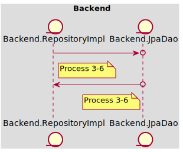
#### <span id='flow-1-10'>Flow 1-10</span>
verify the sql
##### Processes
- **Process 3-7 | Backend.JpaDao, depends on Mock<Backend.Postgres> | 60 mins**
  
----
##### Sequence Diagram

### <span id='ac-2'>AC 2</span>
when i am a customer,
i can see my shopping cart with the products that i added before,
so that i can review the amount and total price of them
#### Mockup
----

#### <span id='flow-2-1'>Flow 2-1</span>
render shopping cart
##### Processes
- **Process 1-2 | Web.UiComponent, depends on Mock<Web.AxiosClient> | 60 mins**
  click 'the shopping cart' icon
  *Web.UiComponent -> Mock<Web.AxiosClient>*
  receive response with shopping cart info
  display the product list and the total price
----
##### Sequence Diagram
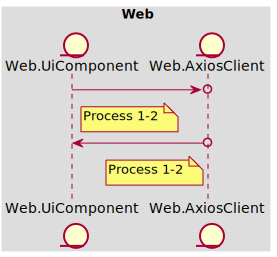
#### <span id='flow-2-2'>Flow 2-2</span>
call bff api
##### Processes
- **Process 1-3 | Web.AxiosClient, depends on Fake<Bff.Controller> | 0 mins**
  \> GET /shoppingCart
  *Web.AxiosClient -> Fake<Bff.Controller>*
  < 200 OK
----
##### Sequence Diagram
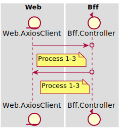
#### <span id='flow-2-3'>Flow 2-3</span>
call service
##### Processes
- **Process 2-1 | Bff.Controller, depends on Mock<Bff.Service> | 60 mins**
  retrieve user id from authentication header
  *Bff.Controller -> Mock<Bff.Service>*
----
##### Sequence Diagram

#### <span id='flow-2-4'>Flow 2-4</span>
call feign client
##### Processes
- **Process 2-2 | Bff.Service, depends on Mock<Bff.FeignClient> | 60 mins**
  
----
##### Sequence Diagram

#### <span id='flow-2-5'>Flow 2-5</span>
call backend api
##### Processes
- **Process 2-3 | Bff.FeignClient, depends on Fake<Backend.Controller> | 60 mins**
  \> GET /shoppingCart
  *Bff.FeignClient -> Fake<Backend.Controller>*
  < 200 OK
----
##### Sequence Diagram
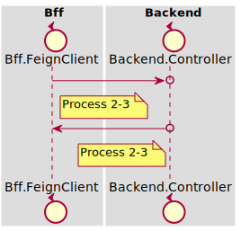
#### <span id='flow-2-6'>Flow 2-6</span>
call usecase
##### Processes
- **Process 3-1 | Backend.Controller, depends on Mock<Backend.Usecase> | 60 mins**
  call usecase to find the shopping cart by user id
  *Backend.Controller -> Mock<Backend.Usecase>*
----
##### Sequence Diagram
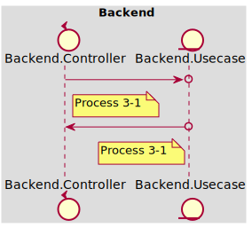
#### <span id='flow-2-7'>Flow 2-7</span>
call domain service
##### Processes
- **Process 3-2 | Backend.Usecase, depends on Mock<Backend.DomainService> | 60 mins**
  
----
##### Sequence Diagram

#### <span id='flow-2-8'>Flow 2-8</span>
call domain repo
##### Processes
- **Process 3-3 | Backend.DomainService, depends on Mock<Backend.DomainRepository> | 60 mins**
  
----
##### Sequence Diagram
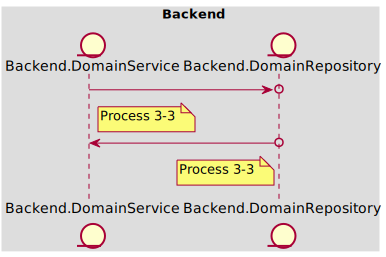
#### <span id='flow-2-9'>Flow 2-9</span>
call dao and client to collect data
##### Processes
- **Process 3-6 | Backend.RepositoryImpl, depends on Mock<Backend.JpaDao> | 60 mins**
  
                          implement domain repository and search shopping cart in db
                          get shopping cart with product id
                   
  *Backend.RepositoryImpl -> Mock<Backend.JpaDao>*
----
- **Process 3-4 | Backend.RepositoryImpl, depends on Mock<Backend.FeignClient> | 60 mins**
  get product by id
  *Backend.RepositoryImpl -> Mock<Backend.FeignClient>*
  returns shopping cart
----
##### Sequence Diagram
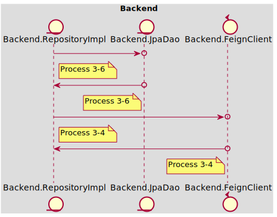
#### <span id='flow-2-10'>Flow 2-10</span>
call db
##### Processes
- **Process 3-7 | Backend.JpaDao, depends on Mock<Backend.Postgres> | 60 mins**
  use h2
  *Backend.JpaDao -> Mock<Backend.Postgres>*
----
##### Sequence Diagram

#### <span id='flow-2-11'>Flow 2-11</span>
call api
##### Processes
- **Process 3-5 | Backend.FeignClient, depends on Mock<Backend.HttpClient> | 60 mins**
  use Wiremock
  *Backend.FeignClient -> Mock<Backend.HttpClient>*
----
##### Sequence Diagram
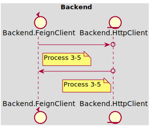
### <span id='ac-3'>AC 3</span>
dsl demo
#### Mockup
----


#### Links
- [Google 1](https://www.google.com)
- [Google 2](https://www.google.com)
#### <span id='flow-3-1'>Flow 3-1</span>
nested calls
##### Processes
- **Process 1-2 | Web.UiComponent, depends on Mock<Web.AxiosClient> | 60 mins**
  click
  *Web.UiComponent -> Mock<Web.AxiosClient>*
  send request
----
- **Process 1-3 | Web.AxiosClient, depends on Fake<Bff.Controller> | 0 mins**
  \> GET /go-google
  *Web.AxiosClient -> Fake<Bff.Controller>*
  < 200 OK
----
- **Process 2-1 | Bff.Controller, depends on Mock<Bff.Service> | 60 mins**
  execute
  *Bff.Controller -> Mock<Bff.Service>*
----
- **Process 2-2 | Bff.Service, depends on Mock<Bff.FeignClient> | 60 mins**
  \> GET /go-google
  *Bff.Service -> Mock<Bff.FeignClient>*
  < 200 OK
----
##### Sequence Diagram
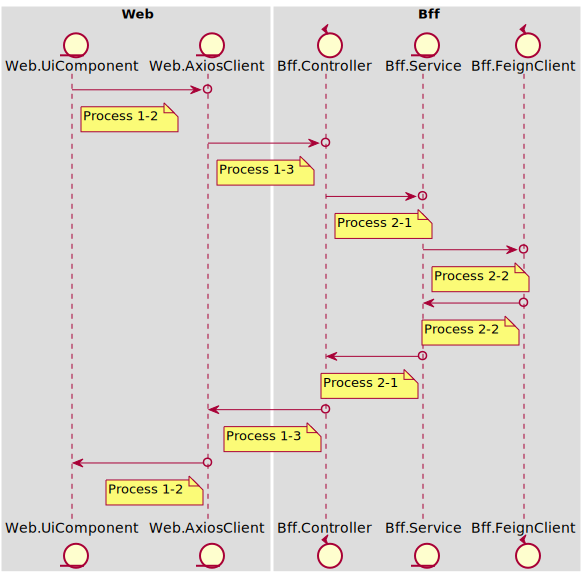
### API Schema
#### Get ShoppingCart
> GET /shoppingCart
- 200 OK
- 404 NOT_FOUND
### Project Process Definition
#### Web
##### Process 1-1 | UiComponent => Real\<UiComponent>
- Just import related ui component, testing with snapshot
##### Process 1-2 | UiComponent => Mock\<AxiosClient>
- Mock axios client
- Call axios client, assert component state
##### Process 1-3 | AxiosClient => Fake\<Bff.Controller>
- Fake api endpoint
- Call fake api, assert the response and error handling is correct
#### Bff
##### Process 2-1 | Controller => Mock\<Service>
- Mock service
- Call service, verify the expected input parameters and assert the expected output return
##### Process 2-2 | Service => Mock\<FeignClient>
- Mock feign client
- Call feign client, verify the expected input parameters and assert the expected output return
##### Process 2-3 | FeignClient => Fake\<Backend.Controller>
- Setup endpoints in wiremock with fake payload
- Setup wiremock's url as base url
- Call upstream endpoints and verify the data object that formatted from json is expected
#### Backend
##### Process 3-1 | Controller => Mock\<Usecase>
- Mock usecase
- Call usecase, verify the expected input parameters and assert the expected output return
##### Process 3-2 | Usecase => Mock\<DomainService>
- Mock domain service
- Call domain service, verify the expected input parameters and assert the expected output return
##### Process 3-3 | DomainService => Mock\<DomainRepository>
- Mock domain repository
- Call domain repository, verify the expected input parameters and assert the expected output return
##### Process 3-4 | RepositoryImpl => Mock\<FeignClient>
- Mock feign client
- Call feign client, verify the expected input parameters and assert the expected output return
##### Process 3-5 | FeignClient => Mock\<HttpClient>
- Fake http client (using wiremock)
- Call http client, stub the request and response and assert the expected response status and payload
##### Process 3-6 | RepositoryImpl => Mock\<JpaDao>
- Mock jpa dao
- Call jpa dao, verify the expected input parameters and assert the expected output return
##### Process 3-7 | JpaDao => Mock\<Postgres>
- Fake db (using h2 or docker)
- Call fake db, init some test data and assert the execution result set is expected