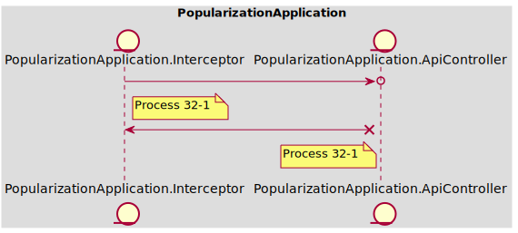
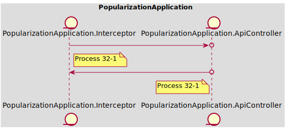
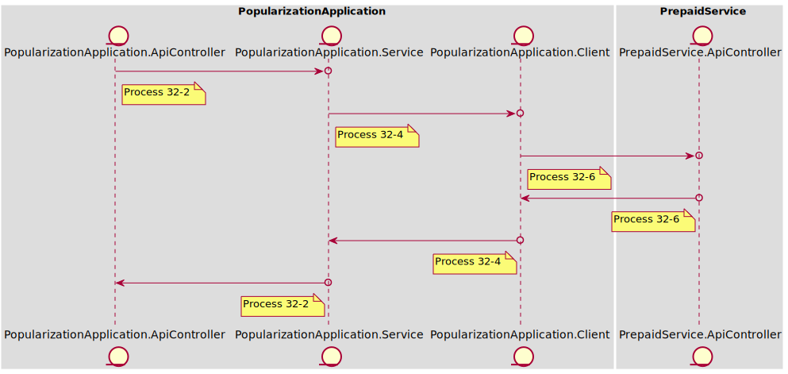
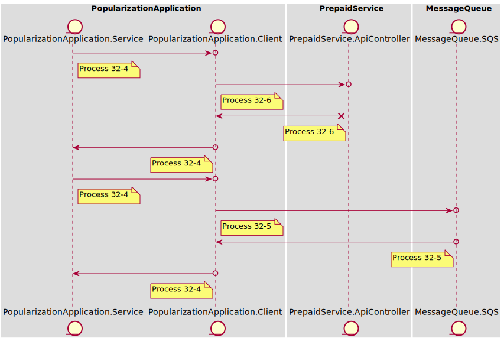
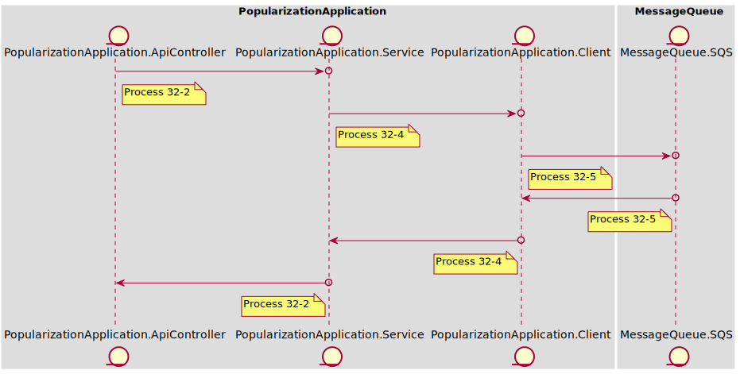
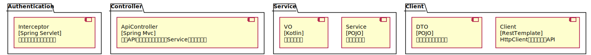

### Table of Content
- [In Scope](#in-scope)
- [Out of Scope](#out-of-scope)
- [AC 1 如果是非预充值用户，无法访问退款功能](#ac-1)
  - [Example 1-1 匿名用户访问退款API时，返回401和错误信息](#example-1-1)
  - [Example 1-2 个人用户访问退款API时，返回401和错误信息](#example-1-2)
  - [Example 1-3 未开通预充值的经纪人用户访问退款API时，返回401和错误信息](#example-1-3)
- [AC 2 如果是预充值用户，提交退款申请到预充值服务](#ac-2)
  - [Example 2-1 预充值用户访问退款API时，返回200](#example-2-1)
  - [Example 2-2 调用退款API，提交申请到预充值服务](#example-2-2)
- [AC 3 如果是预充值用户，提交退款申请到预充值服务，返回余额不足退款失败，告知用户](#ac-3)
  - [Example 3-1 调用退款API，通过预充值服务进行退款时告知余额不足](#example-3-1)
- [AC 4 如果是预充值用户，预充值服务不可用时，提交退款申请到消息队列进行缓存](#ac-4)
  - [Example 4-1 通过预充值服务进行退款时，预充值服务不可用，转发申请到消息队列](#example-4-1)
- [AC 5 接收预充值服务回调：退款成功、失败，发送消息通知用户](#ac-5)
  - [Example 5-1 接收预充值服务的回调，更新退款信息并发送消息](#example-5-1)
- [API Schema](#api-schema)
# Baseline001
### In Scope
> **作为** 预充值用户，
> **我想要** 将预充值账户中的月退回资金账户，
> **以便于** 灵活使用个人或公司的资金

预充值用户将对预充值的余额进行退款操作，在推广服务应用服务中为下游BFF服务提供退款API，并调用上游预充值服务完成退款功能
### Out of Scope
只包括 推广服务应用服务 的API功能，相关的外部API将由其他卡来实现
- 消费方：前端页面、BFF、预充值服务（回调）
- 依赖方：
    - 预充值服务API
        - 发起退款申请
        - 消费消息队列中等待的退款申请
        - 超过expire时间的处理
    - 消息队列API
        - 发送退款消息
        - 发送通知消息
### <span id='ac-1'>AC 1 </span>
如果是非预充值用户，无法访问退款功能
#### <span id='example-1-1'>Example 1-1 匿名用户访问退款API时，返回401和错误信息</span>
##### Tasks
- **Process 32-1 | 10 mins**
> PopularizationApplication.Interceptor, depends on Stub<PopularizationApplication.ApiController>

  创建RefundApi, 加上@Secured("ROLE_PREPAID")只允许经纪人访问；
  当作为未知用户调用RefundApi时，身份验证失败抛出异常并返回401；
  \> POST /prepaid/{account_id}/refund
  < 401 UNAUTHORIZED

----
##### Diagram

#### <span id='example-1-2'>Example 1-2 个人用户访问退款API时，返回401和错误信息</span>
##### Tasks
- **Process 32-1 | 10 mins**
> PopularizationApplication.Interceptor, depends on Stub<PopularizationApplication.ApiController>

  当作为个人用户调用RefundApi时（@WithMockUser(roles = ["INDIVIDUAL"])），身份验证失败抛出异常并返回401；
  \> POST /prepaid/{account_id}/refund
  < 401 UNAUTHORIZED

----
##### Diagram

#### <span id='example-1-3'>Example 1-3 未开通预充值的经纪人用户访问退款API时，返回401和错误信息</span>
##### Tasks
- **Process 32-1 | 10 mins**
> PopularizationApplication.Interceptor, depends on Stub<PopularizationApplication.ApiController>

  当作为个人用户调用RefundApi时（@WithMockUser(roles = ["OFFICER"])），身份验证失败抛出异常并返回401；
  \> POST /prepaid/{account_id}/refund
  < 401 UNAUTHORIZED

----
##### Diagram

### <span id='ac-2'>AC 2 </span>
如果是预充值用户，提交退款申请到预充值服务
#### <span id='example-2-1'>Example 2-1 预充值用户访问退款API时，返回200</span>
##### Tasks
- **Process 32-1 | 10 mins**
> PopularizationApplication.Interceptor, depends on Stub<PopularizationApplication.ApiController>

  当作为预充值用户调用RefundApi时（@WithMockUser(roles = ["PREPAID"])），返回200;
  \> POST /prepaid/{account_id}/refund
  < 200 OK

----
##### Diagram

#### <span id='example-2-2'>Example 2-2 调用退款API，提交申请到预充值服务</span>
##### Tasks
- **Process 32-2 | 0 mins**
> PopularizationApplication.ApiController, depends on Mock<PopularizationApplication.Service>

  获取请求参数和用户user_id，并调用RefundService执行退款操作

----
- **Process 32-4 | 0 mins**
> PopularizationApplication.Service, depends on Mock<PopularizationApplication.Client>

  调用PrepaidClient-预支付服务接口

----
- **Process 32-6 | 0 mins**
> PopularizationApplication.Client, depends on Mock<PrepaidService.ApiController>, using Wiremock

  成功调用预支付服务API，返回200；
  \> POST /prepaid/{account_id}/refund
  < 200 OK

----
##### Diagram

### <span id='ac-3'>AC 3 </span>
如果是预充值用户，提交退款申请到预充值服务，返回余额不足退款失败，告知用户
#### <span id='example-3-1'>Example 3-1 调用退款API，通过预充值服务进行退款时告知余额不足</span>
##### Tasks
- **Process 32-2 | 0 mins**
> PopularizationApplication.ApiController, depends on Mock<PopularizationApplication.Service>

  捕获FeignClientException.BadRequest，获取错误码和信息并通过ResponseEntity返回

----
- **Process 32-4 | 0 mins**
> PopularizationApplication.Service, depends on Mock<PopularizationApplication.Client>

  Service会透传Client抛出的Exception

----
- **Process 32-6 | 0 mins**
> PopularizationApplication.Client, depends on Mock<PrepaidService.ApiController>, using Wiremock

  预支付服务退款API返回400错误；
  \> POST /prepaid/{account_id}/refund
  < 400 BAD_REQUEST

----
##### Diagram

### <span id='ac-4'>AC 4 </span>
如果是预充值用户，预充值服务不可用时，提交退款申请到消息队列进行缓存
#### <span id='example-4-1'>Example 4-1 通过预充值服务进行退款时，预充值服务不可用，转发申请到消息队列</span>
##### Tasks
- **Process 32-4 | 0 mins**
> PopularizationApplication.Service, depends on Mock<PopularizationApplication.Client>

  捕获FeignServerException，打印日志

----
- **Process 32-6 | 0 mins**
> PopularizationApplication.Client, depends on Mock<PrepaidService.ApiController>, using Wiremock

  预支付服务接口调用失败，返回5xx错误
  \> POST /prepaid/{account_id}/refund
  < 500 INTERNAL_SERVER_ERROR

----
- **Process 32-4 | 0 mins**
> PopularizationApplication.Service, depends on Mock<PopularizationApplication.Client>

  组装DTO，调用MqClient发布异步任务
  Service无异常抛出

----
- **Process 32-5 | 0 mins**
> PopularizationApplication.Client, depends on Spy<MessageQueue.SQS>, using Wiremock

  \> POST /events
  < 200 OK

----
##### Diagram

### <span id='ac-5'>AC 5 </span>
接收预充值服务回调：退款成功、失败，发送消息通知用户
#### <span id='example-5-1'>Example 5-1 接收预充值服务的回调，更新退款信息并发送消息</span>
##### Tasks
- **Process 32-2 | 0 mins**
> PopularizationApplication.ApiController, depends on Mock<PopularizationApplication.Service>

  获取退款结果信息包装成VO
  \> POST /prepaid/{account_id}/refund/{rid}/confirmation
  < 200 OK

----
- **Process 32-4 | 0 mins**
> PopularizationApplication.Service, depends on Mock<PopularizationApplication.Client>

  将退款信息VO序列化成通知消息，并通过Client进行发送
  - `退款成功，<refund_amount>已退回到您的<account>账户。`
  - `退款失败，<reason>。`

----
- **Process 32-5 | 0 mins**
> PopularizationApplication.Client, depends on Spy<MessageQueue.SQS>, using Wiremock

  \> POST /events
  < 200 OK

----
##### Diagram

### API Schema
#### 退款API
> POST /prepaid/{account_id}/refund
- 200 OK
  - Request
  ```json
  {
      "refund_amount": 100.00,
      "currency": "CHN_YUAN",
      "account": "WECHAT"
  }
  ```
- 401 UNAUTHORIZED
  - Request
  ```json
  {
      "refund_amount": 100.00,
      "currency": "CHN_YUAN",
      "account": "WECHAT"
  }
  ```
  - Response
  ```json
  {
      "msg": "未授权的操作，请重试"
  }
  ```
#### 退款结果更新
> POST /prepaid/{account_id}/refund/{rid}/confirmation
- 200 OK
  - Request
  ```json
  {
      "refund_amount": 100.00,
      "currency": "CHN_YUAN",
      "account": "WECHAT",
      "requestor": "<user_id>",
      "status": "<status>",
      "reason": "<reason>",
      "updatedAt": "<datetime_iso>"
  }
  ```
### Related Architecture
### PopularizationApplication
推广服务应用服务: 向前端服务/应用提供推广服务和与充值服务相关的功能接口
Tech Stack: **[Spring, Kotlin]**
Owner: **[Li Si]**


#### Processes
##### Process 32-1 | Interceptor => Stub\<ApiController>
Interceptor和Controller依赖于Spring，需要启动整个容器参与测试；
```
// Q1 组件测试，基于Spring Security Test
```
##### Process 32-2 | ApiController => Mock\<Service>
保证Controller配置了正确的API，接收请求调用Service并返回正确的Json数据；
```
// Q1 组件测试，基于WebMvcTest
```
##### Process 32-3 | Service => Mock\<Service>
需要保证对Service调用的入参和返回都正确；
 ```
// Q1 单元测试
 ```
##### Process 32-4 | Service => Mock\<Client>
需要保证对Client调用的入参和返回都正确；
 ```
// Q1 单元测试
 ```
##### Process 32-5 | Client => Spy\<MessageQueue.SQS>[Wiremock]
处于进程边界，需要真实的Http调用；发送消息是异步操作只需要保证入参正确即可；
 ```
// Q1 单元测试
 ```
##### Process 32-6 | Client => Mock\<PrepaidService.ApiController>[Wiremock]
处于进程边界，需要真实的Http调用；需要保证对外调用的入参和返回都正确；
 ```
// Q1 单元测试
 ```

