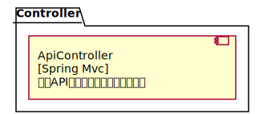

[TOC]
# Architecture Map of rental
##### ChangeLogs
define processes

## Frontend
### GeneralWebPortal
思沃租房通用版Web端: 供浏览用戶、个人用戶和经纪人用戶使用Web访问
Tech Stack: [React]

### IndividualApp4Android
思沃租房App个人版Android端: 供浏览用戶、个人用戶使用Android端APP访问, 以完成个人用戶相关的功能
Tech Stack: [Android, Kotlin]

### IndividualApp4IOS
思沃租房App个人版IOS端: 供浏览用戶、个人用戶使用IOS端APP访问, 以完成个人用戶相关的功能
Tech Stack: [Swift]

### OfficerApp4Android
思沃租房App经纪人版Android端: 供经纪人用戶使用Android端APP访问, 以完成经纪人相关的功能
Tech Stack: [Android, Kotlin]

### OfficerApp4IOS
思沃租房App经纪人版IOS端: 供经纪人用戶使用IOS端APP访问, 以完成经纪人相关的功能
Tech Stack: [Swift]

### ManagementPortal
后台管理系统Web端: 供思沃租房工作人员使用Web访问, 以完成后台管理功能
Tech Stack: [React]

## BFF
### WebApiBff
思沃租房Web Bff: 基于后端应用服务, 服务于思沃租房通用版Web端
Tech Stack: [go]

### MobileApiBff
思沃租房Mobile Bff: 基于后端应用服务, 服务于思沃租房通APP, 包括个人版和经纪人版, Android和IOS端
Tech Stack: [nodejs]

## ApplicationService
### ManagementApplication
后台管理应用服务: 向前端服务/应用提供后台管理的功能接口
Tech Stack: [Spring Boot]

### PopularizationApplication
推广服务应用服务: 向前端服务/应用提供推广服务和与充值服务相关的功能接口
Tech Stack: [Spring, Kotlin]

#### Processes
##### Process 32-1 | Interceptor => Stub\<AuthenticationService.ApiController>[Wiremock]
处于进程边界，需要真实的Http调用；
身份信息JWT来自于下游BFF，校验结果来自于上游鉴权认证服务；
该进程内只针对校验结果做处理；只需要Stub每次调用的认证结果即可
##### Process 32-2 | ApiController => Mock\<Service>
需要保证对Service调用的入参和返回都正确
##### Process 32-3 | Service => Mock\<Service>
需要保证对Service调用的入参和返回都正确
##### Process 32-4 | Service => Mock\<Client>
需要保证对Client调用的入参和返回都正确
##### Process 32-5 | Client => Spy\<MessageQueue.SQS>[Wiremock]
处于进程边界，需要真实的Http调用；发送消息是异步操作只需要保证入参正确即可
##### Process 32-6 | Client => Mock\<PrepaidService.ApiController>[Wiremock]
处于进程边界，需要真实的Http调用；需要保证对外调用的入参和返回都正确
### RentalApplication
租赁信息应用服务: 向前端服务/应用提供租赁信息的展示、搜索、发布、更新、下架等功能接口
Tech Stack: [Spring Boot]

## CoreBizService
### PopularizationService
信息推广服务: 提供信息推广服务协议上下文中的业务能力接口
Tech Stack: **[Spring Boot]**

### PrepaidService
预充值服务: 提供预充值服务协议上下文中的业务能力接口
Tech Stack: [Spring Boot]

## DomainService
### AuthenticationService
鉴权认证服务: 负责提供用戶的身份和鉴权等功能
Tech Stack: [Spring Boot]

### RentalInfoMgmtService
房屋信息管理系统: 存储、查询和管理房屋租赁信息的 CMS 系统
Tech Stack: [Strapi]

### UserManagementService
用戶账戶管理系统: 负责管理用戶账戶,包括常⻅的用戶账戶相关功能
Tech Stack: [Spring Boot]