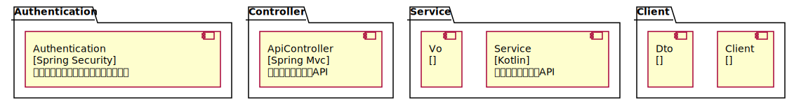

# Architecture Map of rental
##### ChangeLogs
add components for Popularization Application

## Frontend
### GeneralWebPortal
思沃租房通用版 Web端
Tech Stack: [React]
Owner: []
### IndividualApp4Android
思沃租房App 个人版 Android端
Tech Stack: [Android, Kotlin]
Owner: []
### IndividualApp4IOS
思沃租房App 个人版 IOS端
Tech Stack: [Swift]
Owner: []
### OfficerApp4Android
思沃租房App 经纪人版 Android端
Tech Stack: [Android, Kotlin]
Owner: []
### OfficerApp4IOS
思沃租房App 经纪人版 IOS端
Tech Stack: [Swift]
Owner: []
### ManagementPortal
后台管理系统 Web端
Tech Stack: [React]
Owner: []
## BFF
### WebApiBff
思沃租房 Web Bff
Tech Stack: [go]
Owner: []
### MobileApiBff
思沃租房 Mobile Bff
Tech Stack: [nodejs]
Owner: []
## ApplicationService
### ManagementApplication
后台管理 应用服务
Tech Stack: [Spring Boot]
Owner: []
### PopularizationApplication
推广服务 应用服务
Tech Stack: [Spring, Kotlin]
Owner: []

### RentalApplication
租赁信息 应用服务
Tech Stack: [Spring Boot]
Owner: []
## CoreBizService
### PopularizationService
信息推广服务
Tech Stack: [Spring Boot]
Owner: []
### PrepaidService
预充值服务
Tech Stack: [Spring Boot]
Owner: []
## DomainService
### AuthenticationService
鉴权认证服务
Tech Stack: [Spring Boot]
Owner: []
### RentalInfoMgmtService
房屋信息管理系统
Tech Stack: [go]
Owner: []
### UserManagementService
用户账户管理系统
Tech Stack: [Spring Boot]
Owner: []