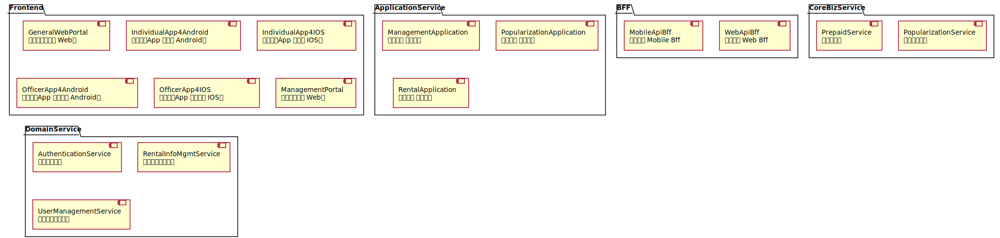

# Architecture Map of rental
##### ChangeLogs
add components for Popularization Application

## Frontend
### GeneralWebPortal
思沃租房通用版 Web端
### IndividualApp4Android
思沃租房App 个人版 Android端
### IndividualApp4IOS
思沃租房App 个人版 IOS端
### OfficerApp4Android
思沃租房App 经纪人版 Android端
### OfficerApp4IOS
思沃租房App 经纪人版 IOS端
### ManagementPortal
后台管理系统 Web端
## BFF
### WebApiBff
思沃租房 Web Bff
### MobileApiBff
思沃租房 Mobile Bff
## ApplicationService
### ManagementApplication
后台管理 应用服务
### PopularizationApplication
推广服务 应用服务

- Authentication
  - PopularizationApplication.Authentication
- Controller
  - PopularizationApplication.CacheController
  - PopularizationApplication.ApiController
- Service
  - PopularizationApplication.Service
  - PopularizationApplication.Vo
- Client
  - PopularizationApplication.Client
  - PopularizationApplication.Dto
### RentalApplication
租赁信息 应用服务
## CoreBizService
### PopularizationService
信息推广服务
### PrepaidService
预充值服务
## DomainService
### AuthenticationService
鉴权认证服务
### RentalInfoMgmtService
房屋信息管理系统
### UserManagementService
用户账户管理系统