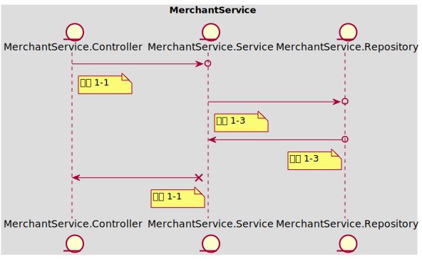
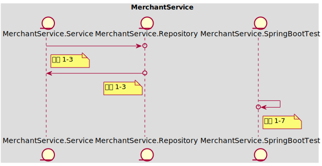
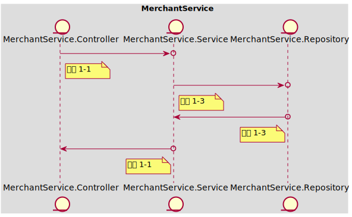
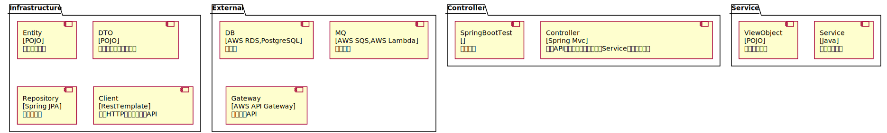

### Table of Content
- [In Scope](#in-scope)
- [Out of Scope](#out-of-scope)
- [AC 1 当提现金额小于或等于当前余额时，提现成功](#ac-1)
  - [示例 1-1 当前余额100，提现100](#example-1-1)
  - [示例 1-2 当前余额100，提现99](#example-1-2)
- [AC 2 当提现金额大于当前余额时，提现失败](#ac-2)
  - [示例 2-1 当前余额100，提现金额101](#example-2-1)
  - [示例 2-2 当前余额100，提现金额100，并发执行100次时，仅能成功1次](#example-2-2)
- [AC 3 当提现完成时，标记提现数据](#ac-3)
  - [示例 3-1 更新提现记录状态为'已完成'](#example-3-1)
- [API Schema](#api-schema)
# Baseline001
### In Scope
作为 【入驻商家】，我想要 【进行余额的提现】，以便于【将店铺运营的利润转化为实际的收入】

Notes：
- 提现金额 < 当前余额
- 当前余额可能会因为投诉而被扣减，需要考虑并发问题
### Out of Scope
假设：所依赖的外部接口均已开发完成，直接调用即可
假设：提现完成后会由消息队列发起回调，提示提现完成
### <span id='ac-1'>AC 1 </span>
当提现金额小于或等于当前余额时，提现成功
#### <span id='example-1-1'>示例 1-1 当前余额100，提现100</span>
##### 任务列表
 - **工序 1-1 | Mock<MerchantService.Service> | 15 mins**
 
	获取请求参数`merchant_account_id, amount`，调用mock Service
	```
	API Call:
	> POST /merchant-account/balance/withdraw
	< 200 OK
	```
 
----
 - **工序 1-3 | Mock<MerchantService.Repository> | 20 mins**
 
	通过`merchant_account_id`查询当前余额，调用mock Repository返回商家账户信息 - 余额100
	新增一条"处理中"的提现记录，mock Repository创建一条提现记录
	扣减余额为0，mock Repository进行保存
 
----
 - **工序 1-6 | Fake<MerchantService.DB> | 30 mins**
 
	测试Repository能够使用Entity操作数据库并执行对应的SQL语句
 
----
 - **工序 1-2 | Mock<MerchantService.Client> | 20 mins**
 
	创建一条提现申请消息，调用mock Client进行发送消息
 
----
 - **工序 1-4 | Mock<MerchantService.MQ> | 25 mins**
 
	mock MQ收到了的消息请求中的余额 = 100
	```
	API Call:
	> POST /messages
	< 200 OK
	```
 
----
##### 时序图

#### <span id='example-1-2'>示例 1-2 当前余额100，提现99</span>
##### 任务列表
 - **工序 1-3 | Mock<MerchantService.Repository> | 20 mins**
 
	通过`merchant_account_id`查询当前余额，调用mock Repository返回商家账户信息 - 余额100
	新增一条"处理中"的提现记录，mock Repository创建一条提现记录
	扣减余额为1，mock Repository进行保存
 
----
##### 时序图

### <span id='ac-2'>AC 2 </span>
当提现金额大于当前余额时，提现失败
#### <span id='example-2-1'>示例 2-1 当前余额100，提现金额101</span>
##### 任务列表
 - **工序 1-1 | Mock<MerchantService.Service> | 15 mins**
 
	获取请求参数`merchant_account_id, amount`，调用mock Service抛出异常
	```
	API Call:
	> POST /merchant-account/balance/withdraw
	< 400 BAD_REQUEST
	```
 
----
 - **工序 1-3 | Mock<MerchantService.Repository> | 20 mins**
 
	通过`merchant_account_id`查询当前余额，调用mock Repository返回商家账户信息 - 余额100
	抛出`余额不足`的业务异常
 
----
##### 时序图

#### <span id='example-2-2'>示例 2-2 当前余额100，提现金额100，并发执行100次时，仅能成功1次</span>
##### 任务列表
 - **工序 1-3 | Mock<MerchantService.Repository> | 20 mins**
 
	增加事务注解，更新余额时如果成功更新的行数小于1，则扣减失败
	抛出`余额不足`的业务异常
 
----
 - **工序 1-7 | MerchantService.SpringBootTest | 60 mins**
 
	插入商户账户信息 - 余额100
	并发执行100次
	查询商户账户信息 - 余额0
	查询提现记录 - 仅1条
 
----
##### 时序图

### <span id='ac-3'>AC 3 </span>
当提现完成时，标记提现数据
#### <span id='example-3-1'>示例 3-1 更新提现记录状态为'已完成'</span>
##### 任务列表
 - **工序 1-1 | Mock<MerchantService.Service> | 15 mins**
 
	获取请求参数`withdraw_id, updated_at`, 调用mock Service
	```
	API Call:
	> POST /merchant-account/balance/withdraw/{id}/confirmation
	< 200 OK
	```
 
----
 - **工序 1-3 | Mock<MerchantService.Repository> | 20 mins**
 
	通过`withdraw_id`查询已有提现记录，更新完成状态和完成时间
 
----
##### 时序图

### API Schema
#### 提现API
> POST /merchant-account/balance/withdraw
- 200 OK
  - Request
  ```json
  {
      "merchant_account_id": 100001,
      "amount": 100.00,
      "currency": "CHN_YUAN",
      "channel": "WECHAT",
      "expired_at": "<local date time>"
  }
  ```
- 400 BAD_REQUEST
  - Request
  ```json
  {
      "merchant_account_id": 100001,
      "amount": 100.00,
      "currency": "CHN_YUAN",
      "channel": "WECHAT",
      "expired_at": "<local date time>"
  }
  ```
  - Response
  ```json
  {
      "message": "balance insufficient"
  }
  ```
#### 提现申请消息API
> POST /messages
- 200 OK
  - Request
  ```json
  {
      "topic": "merchant_account_balance_withdraw",
      "callback": "/merchant-account/balance/withdraw/{id}/confirmation"
      "payload": {
          "merchant_account_id": 100001,
          "amount": 100.00,
          "currency": "CHN_YUAN",
          "channel": "WECHAT",
          "expired_at": "<local date time>"
      }
  }
  ```
#### 提现回调API
> POST /merchant-account/balance/withdraw/{id}/confirmation
- 200 OK
  - Request
  ```json
  {
      "merchant_account_id": 100001,
      "updated_at": "<timestamp_iso>"
  }
  ```
### 进程内架构设计
### MerchantService
餐品订购服务: 为商家提供接入平台的服务，包括开通账号、缴纳押金、提现入账余额、收据和发票开具的功能；平台可对违反合作协议的商家进行押金扣减、入账扣减
Tech Stack: **[Spring Boot, PostgreSQL]**
 

#### 工序拆分
##### 工序 1-1 | Controller => Mock\<Service>
实现Controller获取Http请求参数，调用Service并获取ViewObject，再返回序列化的Json数据
##### 工序 1-2 | Service => Mock\<Client>
实现Service调用Client获取DTO，组装成ViewObject并返回
##### 工序 1-3 | Service => Mock\<Repository>
实现Service调用Repository获取Entity，组装成ViewObject并返回
##### 工序 1-4 | Client => Mock\<MQ>
实现Client调用MQ，通过DTO映射请求和返回的Json数据，验证发送和接收的数据正确
##### 工序 1-5 | Client => Mock\<Gateway>
实现Client调用Gateway，通过DTO映射请求和返回的Json数据
##### 工序 1-6 | Repository => Fake\<DB>
实现Repository调用DB，通过Entity映射数据库表，验证JPA的配置正确、数据库表创建正确、SQL语句书写正确
##### 工序 1-7 | SpringBootTest => Real\<SpringBootTest>
实现多个组件在Spring环境下的集成测试，验证框架的功能：拦截器、AOP、日志、事务处理