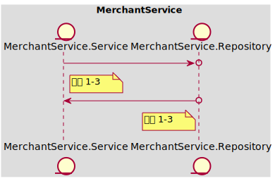
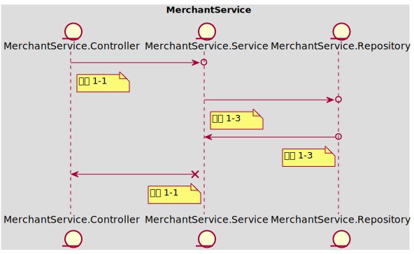
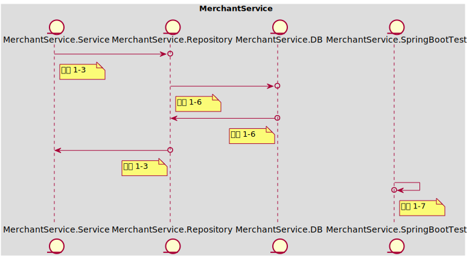

### Table of Content
- [In Scope](#in-scope)
- [Out of Scope](#out-of-scope)
- [API Schema](#api-schema)
- [AC 1 当提现金额小于或等于当前余额时，提现成功](#ac-1)
  - [示例 1-1 当前id：10001，账户余额100；提现100；提现成功后账户id：10001，账户余额为0](#example-1-1)
  - [示例 1-2 当前id：10001，账户余额100；提现99；提现成功后账户id：10001，账户余额为0](#example-1-2)
- [AC 2 当提现金额大于当前余额时，提现失败](#ac-2)
  - [示例 2-1 当前id：10001，账户余额100；提现101；提现失败返回错误信息](#example-2-1)
  - [示例 2-2 当前id：10001，账户余额100；提现100 * 100次；仅成功提现一次，生成一次提现记录：处理中，金额100](#example-2-2)
- [AC 3 当提现完成时，标记提现数据](#ac-3)
  - [示例 3-1 当前提现请求id：1000000，提现状态为处理中；更新后提现记录id：1000000，状态为'已完成'](#example-3-1)
# Baseline001
### In Scope
作为 【入驻商家】，我想要 【进行余额的提现】，以便于【将店铺运营的利润转化为实际的收入】

Notes：
- 提现金额 < 当前余额
- 当前余额可能会因为投诉而被扣减，需要考虑并发问题
### Out of Scope
假设：所依赖的外部接口均已开发完成，直接调用即可
假设：提现完成后会由消息队列发起回调，提示提现完成

### API Schema

#### 商户提现API

> POST /merchant-account/balance/withdraw

- 200 OK

  - Request

  ```json
  {
      "merchant_account_id": 10001,
      "amount": 100.00,
      "currency": "CHN_YUAN",
      "channel": "WECHATPAY"
  }
  ```

- 400 BAD_REQUEST

  - Request

  ```json
  {
      "merchant_account_id": 10001,
      "amount": 100.00,
      "currency": "CHN_YUAN",
      "channel": "WECHATPAY"
  }
  ```

  - Response

  ```json
  {
      "message": "balance insufficient"
  }
  ```

#### 提现申请消息API

> POST /messages

- 200 OK

  - Request

  ```json
  {
      "topic": "merchant_account_balance_withdraw",
      "callback": "/merchant-account/balance/withdraw/{withdrawId}/confirmation"
      "payload": {
          "merchant_account_id": 10001,
          "amount": 100.00,
          "currency": "CHN_YUAN",
          "channel": "WECHATPAY",
      }
  }
  ```

#### 提现成功回调API

> POST /merchant-account/balance/withdraw/{withdrawId}/confirmation

- 200 OK

  - Request

  ```json
  {
      "updated_at": "<timestamp_iso>"
  }
  ```

### <span id='ac-1'>AC 1 </span>
当提现金额小于或等于当前余额时，提现成功
#### <span id='example-1-1'>示例 1-1 当前id：10001，账户余额100；提现100；提现成功后账户id：10001，账户余额为0</span>
##### 任务列表
 - **工序 1-1 | Mock<MerchantService.Service> | 15 mins**

	获取请求参数组装ViewObject，调用mock Service
	```
	API Call:
	> POST /merchant-account/balance/withdraw
	< 200 OK
	```

----
 - **工序 1-3 | Mock<MerchantService.Repository> | 20 mins**

	通过`merchant_account_id`，调用mock Repository查询当前账户余额 - 当前余额100
	组装Entity，调用mock Repository创建一条"处理中"的提现记录
	扣减账户余额为0，调用mock Repository进行保存

----
 - **工序 1-6 | Fake<MerchantService.DB> | 30 mins**

	测试Repository能够使用Entity操作fake 数据库并执行对应的SQL语句

----
 - **工序 1-2 | Mock<MerchantService.Client> | 20 mins**

	组装消息Dto，调用mock Client进行发送一条提现申请消息

----
 - **工序 1-4 | Mock<MerchantService.MQ> | 25 mins**

	验证mock MQ收到了正确的消息请求
	```
	API Call:
	> POST /messages
	< 200 OK
	```

----
##### 时序图

#### <span id='example-1-2'>示例 1-2 当前id：10001，账户余额100；提现99；提现成功后账户id：10001，账户余额为0</span>
##### 任务列表
 - **工序 1-3 | Mock<MerchantService.Repository> | 20 mins**

	通过`merchant_account_id`，调用mock Repository查询当前账户余额 - 当前余额100
	组装Entity，调用mock Repository创建一条"处理中"的提现记录
	扣减账户余额为1，调用mock Repository进行保存

----
##### 时序图

### <span id='ac-2'>AC 2 </span>
当提现金额大于当前余额时，提现失败
#### <span id='example-2-1'>示例 2-1 当前id：10001，账户余额100；提现101；提现失败返回错误信息</span>
##### 任务列表
 - **工序 1-1 | Mock<MerchantService.Service> | 15 mins**

	获取请求参数组装ViewObject，调用mock Service
	```
	API Call:
	> POST /merchant-account/balance/withdraw
	< 400 BAD_REQUEST
	```

----
 - **工序 1-3 | Mock<MerchantService.Repository> | 20 mins**

	通过`merchant_account_id`查询当前余额，调用mock Repository返回商家账户信息 - 余额100
	抛出`余额不足`的业务异常

----
##### 时序图

#### <span id='example-2-2'>示例 2-2 当前id：10001，账户余额100；提现100 * 100次；仅成功提现一次，生成一次提现记录：处理中，金额100</span>
##### 任务列表
 - **工序 1-3 | Mock<MerchantService.Repository> | 20 mins**

	增加事务注解，调用mock Repository进行余额扣减
	扣减失败（更新失败）时，抛出`余额不足`的业务异常

----
 - **工序 1-6 | Fake<MerchantService.DB> | 30 mins**

	使用update set进行数据库扣减，测试Repository能够执行对应的SQL语句

----
 - **工序 1-7 | MerchantService.SpringBootTest | 60 mins**

	提现100，同时执行100次；查询剩余余额为0，提现记录仅1条

----
##### 时序图

### <span id='ac-3'>AC 3 </span>
当提现完成时，标记提现数据
#### <span id='example-3-1'>示例 3-1 当前提现请求id：1000000，提现状态为处理中；更新后提现记录id：1000000，状态为'已完成'</span>
##### 任务列表
 - **工序 1-1 | Mock<MerchantService.Service> | 15 mins**

	获取请求参数组装ViewObject，调用mock Service更新完成状态和完成时间
	```
	API Call:
	> POST /merchant-account/balance/withdraw/{withdrawId}/confirmation
	< 200 OK
	```

----
 - **工序 1-3 | Mock<MerchantService.Repository> | 20 mins**

	通过`withdraw_id`，调用mock Repository查询已有提现记录
	更新完成状态和完成时间并保存

----
 - **工序 1-6 | Mock<MerchantService.Repository> | 20 mins**

	修改Entity，保证数据库能够保存UpdateAt字段

----
##### 时序图
