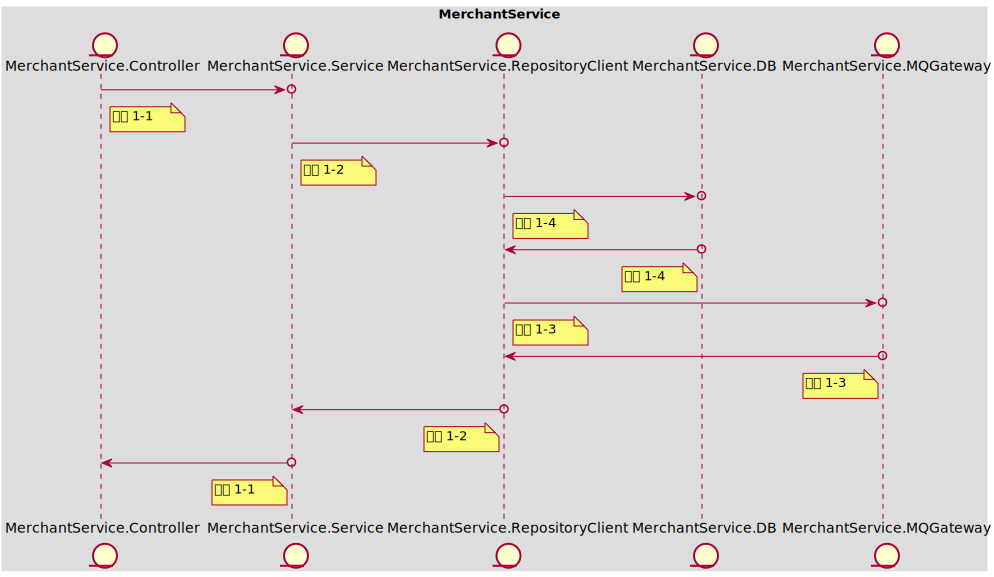
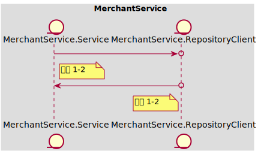
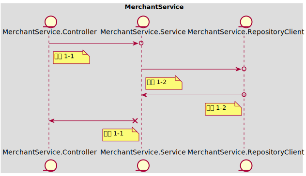
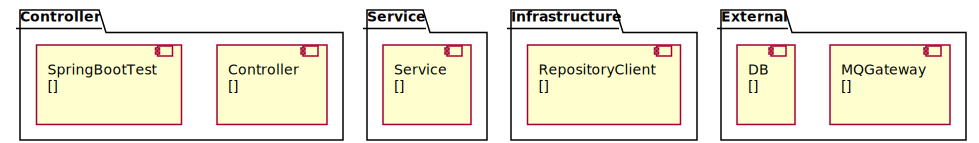

### Table of Content
- [In Scope](#in-scope)
- [Out of Scope](#out-of-scope)
- [AC 1 当提现金额小于或等于当前余额时，提现成功](#ac-1)
  - [示例 1-1 当前id：10001，账户余额100；提现100；提现成功后账户id：10001，账户余额为0](#example-1-1)
  - [示例 1-2 当前id：10001，账户余额100；提现99；提现成功后账户id：10001，账户余额为1](#example-1-2)
- [AC 2 当提现金额大于当前余额时，提现失败](#ac-2)
  - [示例 2-1 当前id：10001，账户余额100；提现101；提现失败返回错误信息](#example-2-1)
  - [示例 2-2 当前id：10001，账户余额100；提现100 * 100次；仅生成一次提现记录：处理中，金额100](#example-2-2)
- [AC 3 当提现完成时，标记提现数据](#ac-3)
  - [示例 3-1 当前提现请求id：1000000，提现状态为处理中；更新后提现记录id：1000000，状态为'已完成'](#example-3-1)
- [API Schema](#api-schema)
# Baseline001
### In Scope
作为 【入驻商家】，我想要 【进行余额的提现】，以便于【将店铺运营的利润转化为实际的收入】

Notes：
- 提现金额 < 当前余额
- 当前余额可能会因为投诉而被扣减，需要考虑并发问题

涉及的数据结构：（可参考API Schema）
- 商家账户包含（id，余额）
- 提现记录包含（id，商家id，提现金额，单位，提现渠道，提现状态，更新时间）
- 提现消息包含（主题，回调url，消息内容）
### Out of Scope
假设：所依赖的外部接口均已开发完成，直接调用即可
假设：提现完成后会由消息队列发起回调，提示提现完成
### <span id='ac-1'>AC 1 </span>
当提现金额小于或等于当前余额时，提现成功
#### <span id='example-1-1'>示例 1-1 当前id：10001，账户余额100；提现100；提现成功后账户id：10001，账户余额为0</span>
##### 任务列表
 - **工序 1-1 | Mock<MerchantService.Service> | 15 mins**
 
	按示例组装ViewObject，mock Service正常执行
	按示例发送Http请求，进行提现
	调用成功，无返回值
	```
	API Call:
	> POST /merchant-account/balance/withdraw
	< 200 OK
	```
 
----
 - **工序 1-2 | Mock<MerchantService.RepositoryClient> | 30 mins**
 
	按示例组装ViewObject
	    - mock Repository返回当前账户Entity（账户余额100）
	    - mock Repository保存当前账户Entity（账户余额0）
	    - mock Repository保存提现记录Entity（状态"处理中"）
	    - mock Client发送提现消息DTO（包含消息主体，消息回调地址和消息体信息)
	调用Service方法，进行提现
	调用成功，无返回值
 
----
 - **工序 1-4 | Fake<MerchantService.DB> | 30 mins**
 
	按示例组装账户信息Entity，能够与fake DB进行交互
	按示例组装提现信息Entity，能够与fake DB进行交互
 
----
 - **工序 1-3 | Mock<MerchantService.MQGateway> | 25 mins**
 
	按示例组装消息DTO，能够与fake Client进行交互
	```
	API Call:
	> POST /messages
	< 200 OK
	```
 
----
##### 时序图

#### <span id='example-1-2'>示例 1-2 当前id：10001，账户余额100；提现99；提现成功后账户id：10001，账户余额为1</span>
##### 任务列表
 - **工序 1-2 | Mock<MerchantService.RepositoryClient> | 30 mins**
 
	按示例组装ViewObject
	    - mock Repository返回当前账户Entity（账户余额100）
	    - mock Repository保存当前账户Entity（账户余额99）
	    - mock Repository保存提现记录Entity（状态"处理中"）
	    - mock Client发送提现消息DTO（包含消息主体，消息回调地址和消息体信息)
	调用Service方法，进行提现
	调用成功，无返回值
 
----
##### 时序图

### <span id='ac-2'>AC 2 </span>
当提现金额大于当前余额时，提现失败
#### <span id='example-2-1'>示例 2-1 当前id：10001，账户余额100；提现101；提现失败返回错误信息</span>
##### 任务列表
 - **工序 1-1 | Mock<MerchantService.Service> | 15 mins**
 
	按示例组装ViewObject，mock Service抛出余额不足异常
	按示例发送Http请求，进行提现
	调用失败，返回错误信息
	```
	API Call:
	> POST /merchant-account/balance/withdraw
	< 400 BAD_REQUEST
	```
 
----
 - **工序 1-2 | Mock<MerchantService.RepositoryClient> | 30 mins**
 
	按示例组装ViewObject
	    - mock Repository返回当前账户Entity（账户余额100）
	调用Service方法，进行提现
	调用失败，抛出余额不足异常
 
----
##### 时序图

#### <span id='example-2-2'>示例 2-2 当前id：10001，账户余额100；提现100 * 100次；仅生成一次提现记录：处理中，金额100</span>
##### 任务列表
 - **工序 1-2 | Mock<MerchantService.RepositoryClient> | 30 mins**
 
	按示例组装ViewObject
	    - mock Repository返回当前账户Entity（账户余额100）
	    - mock Repository直接更新账户余额数据（更新成功返回1，更新失败返回0）
	    - mock Repository保存提现记录Entity（状态"处理中"）
	    - mock Client发送提现消息DTO（包含消息主体，消息回调地址和消息体信息)
	调用Service方法，进行提现
	调用成功，无返回值
 
----
 - **工序 1-4 | Fake<MerchantService.DB> | 30 mins**
 
	mock Repository已存在账户Entity（账户余额100）
	调用update sql方法更新余额数据
	更新成功返回1，更新失败返回0
 
----
 - **工序 1-5 | MerchantService.SpringBootTest | 60 mins**
 
	按示例组装ViewObject
	按示例发送Http请求，并发执行100次，进行提现
	调用完成后监测数据库，仅有一条提现记录生成
 
----
##### 时序图

### <span id='ac-3'>AC 3 </span>
当提现完成时，标记提现数据
#### <span id='example-3-1'>示例 3-1 当前提现请求id：1000000，提现状态为处理中；更新后提现记录id：1000000，状态为'已完成'</span>
##### 任务列表
 - **工序 1-1 | Mock<MerchantService.Service> | 15 mins**
 
	按示例组装ViewObject，mock Service正常执行
	按示例发送Http请求，完成提现请求的确认
	调用成功，无返回值
	```
	API Call:
	> POST /merchant-account/balance/withdraw/{id}/confirmation
	< 200 OK
	```
 
----
 - **工序 1-2 | Mock<MerchantService.RepositoryClient> | 30 mins**
 
	按示例传递请求参数
	    - mock Repository获取提现记录Entity（状态"处理中"）
	    - mock Repository保存更新后的提现记录Entity（状态"完成"）
	调用Service方法，进行提现完成的确认
	调用成功，无返回值
 
----
##### 时序图

### API Schema
#### 商户提现API
> POST /merchant-account/balance/withdraw
- 200 OK
  - Request
  ```json
  {
      "merchant_account_id": 10001,
      "amount": 100.00,
      "currency": "CHN_YUAN",
      "channel": "WECHAT"
  }
  ```
- 400 BAD_REQUEST
  - Request
  ```json
  {
      "merchant_account_id": 10001,
      "amount": 100.00,
      "currency": "CHN_YUAN",
      "channel": "WECHAT"
  }
  ```
  - Response
  ```json
  {
      "message": "balance insufficient"
  }
  ```
#### 提现申请消息API
> POST /messages
- 200 OK
  - Request
  ```json
  {
      "topic": "merchant_account_balance_withdraw",
      "callback": "/merchant-account/balance/withdraw/{id}/confirmation"
      "payload": {
          "merchant_account_id": 10001,
          "amount": 100.00,
          "currency": "CHN_YUAN",
          "channel": "WECHAT"
      }
  }
  ```
#### 提现成功回调API
> POST /merchant-account/balance/withdraw/{id}/confirmation
- 200 OK
  - Request
  ```json
  {
      "merchant_account_id": 10001,
      "updated_at": "<timestamp_iso>"
  }
  ```
### 进程内架构设计
### MerchantService
餐品订购服务: 为商家提供接入平台的服务，包括开通账号、缴纳押金、提现入账余额、收据和发票开具的功能；平台可对违反合作协议的商家进行押金扣减、入账扣减
Tech Stack: **[Spring Boot, PostgreSQL]**
 

#### 工序拆分
##### 工序 1-1 | Controller => Mock\<Service>
实现Controller获取Http请求参数，调用Service并获取ViewObject，再返回序列化的Json数据
##### 工序 1-2 | Service => Mock\<RepositoryClient>
实现Service调用Client获取DTO，组装成ViewObject并返回
##### 工序 1-3 | RepositoryClient => Mock\<MQGateway>
实现Client调用MQ，通过DTO映射请求和返回的Json数据，验证发送和接收的数据正确
##### 工序 1-4 | RepositoryClient => Fake\<DB>
实现Repository调用DB，通过Entity映射数据库表，验证JPA的配置正确、数据库表创建正确、SQL语句书写正确
##### 工序 1-5 | SpringBootTest => Real\<SpringBootTest>
实现多个组件在Spring环境下的集成测试，验证框架的功能：拦截器、AOP、日志、事务处理