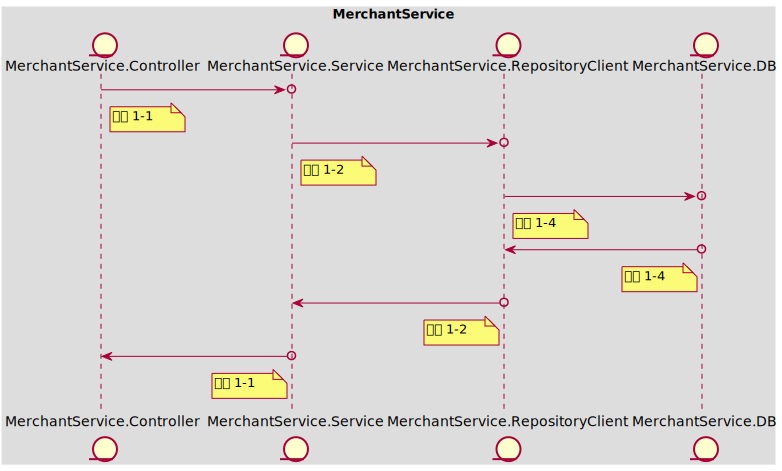
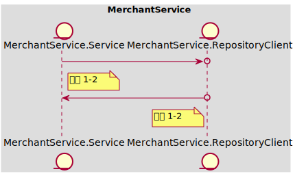

### Table of Content
- [In Scope](#in-scope)
- [Out of Scope](#out-of-scope)
- [AC 1 获得订单收入，余额增加](#ac-1)
  - [示例 1-1 当前商户id：10001，账户余额0；收到订单id：aaaa-bbbb-cccc-dddd，获得收入100；更新后账户id：10001，账户余额为100，新增收入记录，关联订单id：aaaa-bbbb-cccc-dddd](#example-1-1)
  - [示例 1-2 当前商户id：10001，账户余额100；收到订单id：aaaa-bbbb-cccc-dddd，获得收入100；更新后账户id：10001，账户余额为200，新增收入记录，关联订单id：aaaa-bbbb-cccc-dddd](#example-1-2)
- [API Schema](#api-schema)
# Story-1001
### In Scope
作为 【入驻商家】，我想要 【完成订单后获得相应的余额收入】，以便于【查询余额和提现】

涉及的数据结构：（可参考API Schema）
- 商家账户包含（id，余额）
- 收入记录包含（商家id，订单id，收入金额）
### Out of Scope
假设：此接口由下游服务 "订单管理应用服务" 在订单完成后自动调用，返回200时即为确认，返回500时下游服务会自动重试
### <span id='ac-1'>AC 1 </span>
获得订单收入，余额增加
#### <span id='example-1-1'>示例 1-1 当前商户id：10001，账户余额0；收到订单id：aaaa-bbbb-cccc-dddd，获得收入100；更新后账户id：10001，账户余额为100，新增收入记录，关联订单id：aaaa-bbbb-cccc-dddd</span>
##### 任务列表
 - **工序 1-1 | Mock<MerchantService.Service> | 15 mins**

	按示例组装ViewObject，mock Service正常执行
	按示例发送Http请求，进行订单收入入账
	调用成功，无返回值
	```
	API Call:
	> POST /merchant-account/balance/income
	< 200 OK
	```

----
 - **工序 1-2 | Mock<MerchantService.RepositoryClient> | 30 mins**

	按示例组装ViewObject
	    - mock Repository返回当前账户Entity（账户余额0）
	    - mock Repository保存当前账户Entity（账户余额100）
	    - mock Repository保存收入记录Entity
	调用Service方法，进行订单收入入账
	调用成功，无返回值

----
 - **工序 1-4 | Fake<MerchantService.DB> | 30 mins**

	按示例组装收入记录信息Entity，能够通过fake DB进行保存和查询

----
##### 时序图

#### <span id='example-1-2'>示例 1-2 当前商户id：10001，账户余额100；收到订单id：aaaa-bbbb-cccc-dddd，获得收入100；更新后账户id：10001，账户余额为200，新增收入记录，关联订单id：aaaa-bbbb-cccc-dddd</span>
##### 任务列表
 - **工序 1-2 | Mock<MerchantService.RepositoryClient> | 30 mins**

	按示例组装ViewObject
	    - mock Repository返回当前账户Entity（账户余额100）
	    - mock Repository保存当前账户Entity（账户余额200）
	    - mock Repository保存收入记录Entity
	调用Service方法，进行订单收入入账
	调用成功，无返回值

----
##### 时序图

### API Schema
#### 订单收入API
> POST /merchant-account/balance/income
- 200 OK
  - Request
  ```json
  {
      "merchant_account_id": 100001,
      "order_id": "<uuid>",
      "amount": 100
  }
  ```
### 