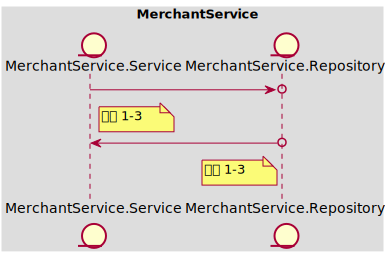

### Table of Content
- [In Scope](#in-scope)
- [Out of Scope](#out-of-scope)
- [AC 1 收到处罚信息，余额扣减](#ac-1)
  - [示例 1-1 当前商户id：10001，账户余额为100；订单id：aaaa-bbbb-cccc-dddd，处罚扣减100；更新后账户id：10001，账户余额为0，订单收入记录增加扣罚信息](#example-1-1)
  - [示例 1-2 当前商户id：10001，账户余额为100；订单id：aaaa-bbbb-cccc-dddd，处罚扣减90；更新后账户id：10001，账户余额为10，订单收入记录增加扣罚信息](#example-1-2)
- [AC 2 收到处罚信息，余额为0时，扣减](#ac-2)
  - [示例 2-1 当前商户id：10001，账户余额为100，押金30000；订单id：aaaa-bbbb-cccc-dddd，处罚扣减110；更新后账户id：10001，账户余额为0，押金29990，订单收入记录增加扣罚信息](#example-2-1)
  - [示例 2-2 当前商户id：10001，账户余额为100，押金10；订单id：aaaa-bbbb-cccc-dddd，处罚扣减110；更新后账户id：10001，账户余额为0，押金0，订单收入记录增加扣罚信息](#example-2-2)
  - [示例 2-3 当前商户id：10001，账户余额为100，押金0；订单id：aaaa-bbbb-cccc-dddd，处罚扣减110；更新后账户id：10001，账户余额为0，押金-10，订单收入记录增加扣罚信息](#example-2-3)
- [API Schema](#api-schema)
# Story-1002
### In Scope
作为 【平台运营】，我想要 【根据合作协议，扣除商家的余额入账】，以便于【作为处罚】

注意事项：
- 当余额扣减为0时，会扣减押金
- 需要返回扣减结果给下游服务（"订单管理应用服务"），以便调用平台通知告知商家
- 押金可为负数（押金<=0时会对商家进行停业整顿，并进行押金补交）
- 扣减记录需要追溯（允许开具发票）
### Out of Scope
假设：此接口由下游服务 "订单管理应用服务" 在订单完成后自动调用，返回200时即为确认，返回500时下游服务会自动重试
### <span id='ac-1'>AC 1 </span>
收到处罚信息，余额扣减
#### <span id='example-1-1'>示例 1-1 当前商户id：10001，账户余额为100；订单id：aaaa-bbbb-cccc-dddd，处罚扣减100；更新后账户id：10001，账户余额为0，订单收入记录增加扣罚信息</span>
##### 任务列表
 - **工序 1-1 | Mock<MerchantService.Service> | 15 mins**

	获取请求参数组装ViewObject，调用mock Service
	```
	API Call:
	> POST /merchant-account/balance/deduct
	< 200 OK
	```

----
 - **工序 1-3 | Mock<MerchantService.Repository> | 20 mins**

	通过"order_id"，调用mock Repository查询已有收入记录
	更新处罚金额和处罚原因，调用mock Repository查询保存收入记录
	扣减账户余额100，调用mock Repository进行更新

----
 - **工序 1-6 | Fake<MerchantService.DB> | 30 mins**

	测试Repository能够使用Entity操作数据库并执行对应的SQL语句

----
##### 时序图

#### <span id='example-1-2'>示例 1-2 当前商户id：10001，账户余额为100；订单id：aaaa-bbbb-cccc-dddd，处罚扣减90；更新后账户id：10001，账户余额为10，订单收入记录增加扣罚信息</span>
##### 任务列表
 - **工序 1-3 | Mock<MerchantService.Repository> | 20 mins**

	通过"order_id"，调用mock Repository查询已有收入记录
	更新处罚金额和处罚原因，调用mock Repository查询保存收入记录
	扣减账户余额90，调用mock Repository进行更新

----
##### 时序图

### <span id='ac-2'>AC 2 </span>
收到处罚信息，余额为0时，扣减
#### <span id='example-2-1'>示例 2-1 当前商户id：10001，账户余额为100，押金30000；订单id：aaaa-bbbb-cccc-dddd，处罚扣减110；更新后账户id：10001，账户余额为0，押金29990，订单收入记录增加扣罚信息</span>
##### 任务列表
 - **工序 1-1 | Mock<MerchantService.Service> | 15 mins**

	获取请求参数组装ViewObject，调用mock Service
	```
	API Call:
	> POST /merchant-account/balance/deduct
	< 200 OK
	```

----
 - **工序 1-3 | Mock<MerchantService.Repository> | 20 mins**

	通过"order_id"，调用mock Repository查询已有收入记录
	更新处罚金额和处罚原因，调用mock Repository查询保存收入记录
	通过"merchant_account_id"，调用mock Repository查询账户信息
	扣减账户余额100，调用mock Repository进行更新
	扣减账户押金10，调用mock Repository进行更新

----
 - **工序 1-6 | Fake<MerchantService.DB> | 30 mins**

	测试Repository能够使用Entity操作数据库并执行对应的SQL语句

----
##### 时序图

#### <span id='example-2-2'>示例 2-2 当前商户id：10001，账户余额为100，押金10；订单id：aaaa-bbbb-cccc-dddd，处罚扣减110；更新后账户id：10001，账户余额为0，押金0，订单收入记录增加扣罚信息</span>
##### 任务列表
 - **工序 1-3 | Mock<MerchantService.Repository> | 20 mins**

	通过"order_id"，调用mock Repository查询已有收入记录
	更新处罚金额和处罚原因，调用mock Repository查询保存收入记录
	通过"merchant_account_id"，调用mock Repository查询账户信息
	扣减账户余额100，调用mock Repository进行更新
	扣减账户押金10，调用mock Repository进行更新

----
##### 时序图

#### <span id='example-2-3'>示例 2-3 当前商户id：10001，账户余额为100，押金0；订单id：aaaa-bbbb-cccc-dddd，处罚扣减110；更新后账户id：10001，账户余额为0，押金-10，订单收入记录增加扣罚信息</span>
##### 任务列表
 - **工序 1-3 | Mock<MerchantService.Repository> | 20 mins**

	通过"order_id"，调用mock Repository查询已有收入记录
	更新处罚金额和处罚原因，调用mock Repository查询保存收入记录
	通过"merchant_account_id"，调用mock Repository查询账户信息
	扣减账户余额100，调用mock Repository进行更新
	扣减账户押金10，调用mock Repository进行更新

----
##### 时序图

### API Schema
#### 订单处罚API
> POST /merchant-account/balance/deduct
- 200 OK
  - Request
  ```json
  {
      "merchant_account_id": 100001,
      "order_id": "<uuid>",
      "deduct_amount": 100
  }
  ```
  - Response
  ```json
  {
      "balance": 100,
      "deposit": 100
  }
  ```

