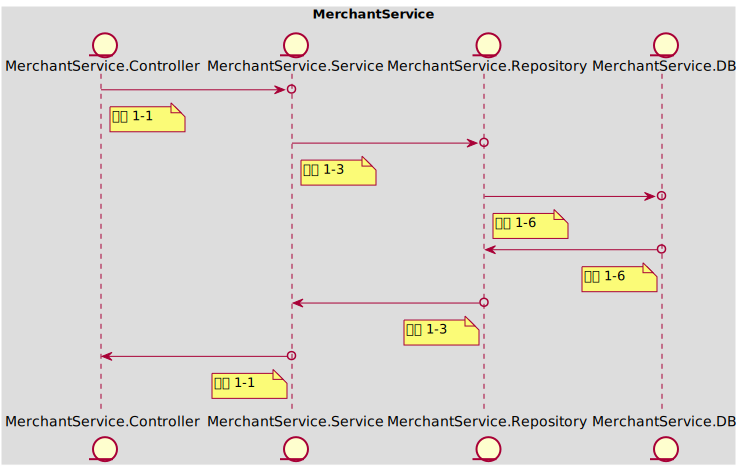

### Table of Content
- [In Scope](#in-scope)
- [Out of Scope](#out-of-scope)
- [AC 1 收到处罚信息，余额扣减](#ac-1)
  - [示例 1-1 余额为100，处罚扣减100，计算后余额为0](#example-1-1)
  - [示例 1-2 余额为100，处罚扣减90，计算后余额为10](#example-1-2)
- [AC 2 收到处罚信息，余额为0时，扣减](#ac-2)
  - [示例 2-1 余额为100，处罚扣减110，押金30000，计算后余额为0，押金为29990](#example-2-1)
  - [示例 2-2 余额为100，处罚扣减110，押金10，计算后余额为0，押金为0](#example-2-2)
  - [示例 2-3 余额为100，处罚扣减110，押金10，计算后余额为0，押金为-10](#example-2-3)
- [API Schema](#api-schema)
# Story-1002
### In Scope
作为 【平台运营】，我想要 【根据合作协议，扣除商家的余额入账】，以便于【作为处罚】

注意事项：
- 当余额扣减为0时，会扣减押金
- 需要返回扣减结果给下游服务（"订单管理应用服务"），以便调用平台通知告知商家
- 押金可为负数（押金<=0时会对商家进行停业整顿，并进行押金补交）
- 扣减记录需要追溯（允许开具发票）
### Out of Scope
假设：此接口由下游服务 "订单管理应用服务" 在订单完成后自动调用，返回200时即为确认，返回500时下游服务会自动重试
### <span id='ac-1'>AC 1 </span>
收到处罚信息，余额扣减
#### <span id='example-1-1'>示例 1-1 余额为100，处罚扣减100，计算后余额为0</span>
##### 任务列表
 - **工序 1-1 | Mock<MerchantService.Service> | 15 mins**
 
	获取请求参数，调用mock Service
	```
	API Call:
	> POST /merchant-account/balance/deduct
	< 200 OK
	```
 
----
 - **工序 1-3 | Mock<MerchantService.Repository> | 20 mins**
 
	通过"order_id"修改已有收入记录，记录处罚金额，mock Repository更新一条收入记录
	更新商户账户的余额 - 0
 
----
 - **工序 1-6 | Fake<MerchantService.DB> | 30 mins**
 
	测试Repository能够使用Entity操作数据库并执行对应的SQL语句
 
----
##### 时序图

#### <span id='example-1-2'>示例 1-2 余额为100，处罚扣减90，计算后余额为10</span>
##### 任务列表
 - **工序 1-3 | Mock<MerchantService.Repository> | 20 mins**
 
	通过"order_id"修改已有收入记录，记录处罚金额，mock Repository更新一条收入记录
	更新商户账户的余额 - 10
 
----
##### 时序图

### <span id='ac-2'>AC 2 </span>
收到处罚信息，余额为0时，扣减
#### <span id='example-2-1'>示例 2-1 余额为100，处罚扣减110，押金30000，计算后余额为0，押金为29990</span>
##### 任务列表
 - **工序 1-1 | Mock<MerchantService.Service> | 15 mins**
 
	获取请求参数，调用mock Service
	```
	API Call:
	> POST /merchant-account/balance/deduct
	< 200 OK
	```
 
----
 - **工序 1-3 | Mock<MerchantService.Repository> | 20 mins**
 
	通过"order_id"修改已有收入记录，记录处罚金额，mock Repository更新一条收入记录
	更新商户账户的余额 - 0
	更新商户账户的押金 - 29990
 
----
 - **工序 1-6 | Fake<MerchantService.DB> | 30 mins**
 
	测试Repository能够使用Entity操作数据库并执行对应的SQL语句
 
----
##### 时序图

#### <span id='example-2-2'>示例 2-2 余额为100，处罚扣减110，押金10，计算后余额为0，押金为0</span>
##### 任务列表
 - **工序 1-3 | Mock<MerchantService.Repository> | 20 mins**
 
	通过"order_id"修改已有收入记录，记录处罚金额，mock Repository更新一条收入记录
	更新商户账户的余额 - 0
	更新商户账户的押金 - 0
 
----
##### 时序图

#### <span id='example-2-3'>示例 2-3 余额为100，处罚扣减110，押金10，计算后余额为0，押金为-10</span>
##### 任务列表
 - **工序 1-3 | Mock<MerchantService.Repository> | 20 mins**
 
	通过"order_id"修改已有收入记录，记录处罚金额，mock Repository更新一条收入记录
	更新商户账户的余额 - 0
	更新商户账户的押金 - -10
 
----
##### 时序图

### API Schema
#### 订单处罚API
> POST /merchant-account/balance/deduct
- 200 OK
  - Request
  ```json
  {
      "merchant_account_id": 100001,
      "order_id": "<uuid>",
      "deduct_amount": 100
  }
  ```
  - Response
  ```json
  {
      "balance": 100,
      "deposit": 100
  }
  ```
### 进程内架构设计
### MerchantService
餐品订购服务: 为商家提供接入平台的服务，包括开通账号、缴纳押金、提现入账余额、收据和发票开具的功能；平台可对违反合作协议的商家进行押金扣减、入账扣减
Tech Stack: **[Spring Boot, PostgreSQL]**
 

#### 工序拆分
##### 工序 1-1 | Controller => Mock\<Service>
实现Controller获取Http请求参数，调用Service并获取ViewObject，再返回序列化的Json数据
##### 工序 1-2 | Service => Mock\<Client>
实现Service调用Client获取DTO，组装成ViewObject并返回
##### 工序 1-3 | Service => Mock\<Repository>
实现Service调用Repository获取Entity，组装成ViewObject并返回
##### 工序 1-4 | Client => Mock\<MQ>
实现Client调用MQ，通过DTO映射请求和返回的Json数据，验证发送和接收的数据正确
##### 工序 1-5 | Client => Mock\<Gateway>
实现Client调用Gateway，通过DTO映射请求和返回的Json数据
##### 工序 1-6 | Repository => Fake\<DB>
实现Repository调用DB，通过Entity映射数据库表，验证JPA的配置正确、数据库表创建正确、SQL语句书写正确
##### 工序 1-7 | SpringBootTest => Real\<SpringBootTest>
实现多个组件在Spring环境下的集成测试，验证框架的功能：拦截器、AOP、日志、事务处理