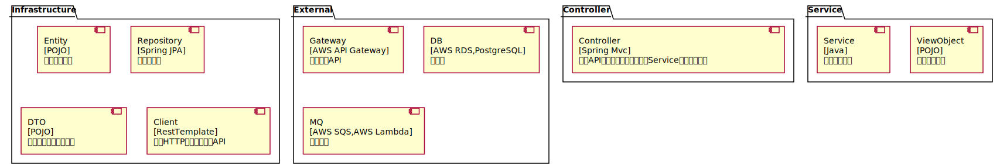

[TOC]
# Architecture Map of want2eat
##### ChangeLogs
绘制需要的架构信息

## CoreBizService
### OrderService
餐品订购服务: 以订单为核心，为订餐用户提供下单、支付、退款、投诉等功能；商户可以接单、拒单，完成备餐后即可获得订单收益
Tech Stack: **[Spring Boot, PostgreSQL]**
 
