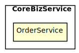
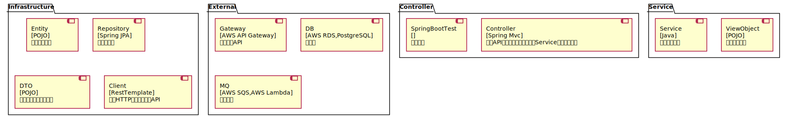

[TOC]
# Architecture Map of want2eat
##### ChangeLogs
工序拆分

## CoreBizService
### OrderService
餐品订购服务: 以订单为核心，为订餐用户提供下单、支付、退款、投诉等功能；商户可以接单、拒单，完成备餐后即可获得订单收益
Tech Stack: **[Spring Boot, PostgreSQL]**
 

#### 工序拆分
##### 工序 1-1 | Controller => Mock\<Service>
- Controller依赖Spring的运行环境，需要启动整个容器参与测试，以保证Controller配置了正确的API，接收请求调用Service并返回正确的Json数据；
- ViewObject仅作为数据对象，验证其序列化的数据是否正确；

测试时，会依赖：
- 进程【内】组件【Service】，采用【Mock】来替代该组件，因为【需要保证对Service调用的入参和返回都正确】
##### 工序 1-2 | Service => Mock\<Client>
- Service只包含业务逻辑，可脱离框架进行单元测试；
- ViewObject、DTO、Entity作为数据对象，验证数据转换时的结果是否正确；

测试时，会依赖：
- 进程【内】组件【Client】，采用【Mock】来替代该组件，因为【需要保证对Client调用的入参和返回都正确】
##### 工序 1-3 | Service => Mock\<Repository>
- Service只包含业务逻辑，可脱离框架进行单元测试；
- ViewObject、DTO、Entity作为数据对象，验证数据转换时的结果是否正确；

测试时，会依赖：
- 进程【内】组件【Repository】，采用【Mock】来替代该组件，因为【需要保证对Repository调用的入参和返回都正确】
##### 工序 1-4 | Client => Mock\<MQ>
- Client需要进行HTTP调用，借助Spring框架可以快速完成测试；
- DTO仅作为数据对象，验证其序列化的数据是否正确；

测试时，会依赖：
- 进程【外】组件【MQ】，采用【Mock】来替代该组件，因为【需要保证对外的HTTP调用的请求参数和返回值符合预期】
##### 工序 1-5 | Client => Mock\<Gateway>
- Client需要进行HTTP调用，借助Spring框架可以快速完成测试；
- DTO仅作为数据对象，验证其序列化的数据是否正确；

测试时，会依赖：
- 进程【外】组件【Gateway】，采用【Mock】来替代该组件，因为【需要保证对外的HTTP调用的请求参数和返回值符合预期】
##### 工序 1-6 | Repository => Fake\<DB>
- Repository依赖Spring JPA，需要启动整个容器参与测试，以保证SQL语句的正确执行；
- Entity仅作为数据对象，验证其序列化的数据是否正确；

测试时，会依赖：
- 进程【外】组件【PostgreSQL】，采用【Fake】来替代该组件，因为【数据库功能繁杂，mock的成本太高】
##### 工序 1-7 | SpringBootTest => Real\<SpringBootTest>
- 测试各个组件连接正确，并能够在Spring环境下正常运行；

测试时，会依赖：
- 进程【外】组件【MQ】，采用【Mock】来替代该组件，因为【需要保证对外的HTTP调用的请求参数和返回值符合预期】
- 进程【外】组件【Gateway】，采用【Mock】来替代该组件，因为【需要保证对外的HTTP调用的请求参数和返回值符合预期】
- 进程【外】组件【PostgreSQL】，采用【Fake】来替代该组件，因为【数据库功能繁杂，mock的成本太高】