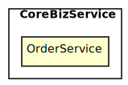
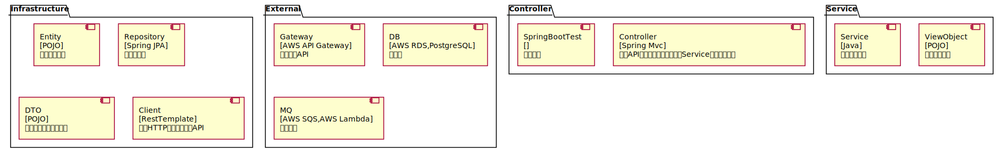

[TOC]
# Architecture Map of want2eat
##### ChangeLogs
按规定格式书写工序设计

## CoreBizService
### OrderService
餐品订购服务: 以订单为核心，为订餐用户提供下单、支付、退款、投诉等功能；商户可以接单、拒单，完成备餐后即可获得订单收益
Tech Stack: **[Spring Boot, PostgreSQL]**

#### 工序拆分
##### 工序 1-1 | Controller => Mock\<Service>
实现Controller获取Http请求参数，调用Service并获取ViewObject，再返回序列化的Json数据
##### 工序 1-2 | Service => Mock\<Client>
实现Service调用Client获取DTO，组装成ViewObject并返回
##### 工序 1-3 | Service => Mock\<Repository>
实现Service调用Repository获取Entity，组装成ViewObject并返回
##### 工序 1-4 | Client => Mock\<MQ>
实现Client调用MQ，通过DTO映射请求和返回的Json数据
##### 工序 1-5 | Client => Mock\<Gateway>
实现Client调用Gateway，通过DTO映射请求和返回的Json数据
##### 工序 1-6 | Repository => Fake\<DB>
实现Repository调用DB，通过JPA正确执行数据库访问并返回对应的Entity数据
##### 工序 1-7 | SpringBootTest => Real\<SpringBootTest>
实现所有组件进行集成测试