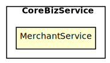

[TOC]
# Architecture Map of want2eat
##### ChangeLogs
准release

## CoreBizService
### MerchantService
餐品订购服务: 为商家提供接入平台的服务，包括开通账号、缴纳押金、提现入账余额、收据和发票开具的功能；平台可对违反合作协议的商家进行押金扣减、入账扣减
Tech Stack: **[Spring Boot, PostgreSQL]**
 

#### 工序拆分
##### 工序 1-1 | Controller => Mock\<Service>
实现Controller获取Http请求参数，调用Service并获取ViewObject，再返回序列化的Json数据
##### 工序 1-2 | Service => Mock\<Client>
实现Service调用Client获取DTO，组装成ViewObject并返回
##### 工序 1-3 | Service => Mock\<Repository>
实现Service调用Repository获取Entity，组装成ViewObject并返回
##### 工序 1-4 | Client => Mock\<MQ>
实现Client调用MQ，通过DTO映射请求和返回的Json数据，验证发送和接收的数据正确
##### 工序 1-5 | Client => Mock\<Gateway>
实现Client调用Gateway，通过DTO映射请求和返回的Json数据
##### 工序 1-6 | Repository => Fake\<DB>
实现Repository调用DB，通过Entity映射数据库表，验证JPA的配置正确、数据库表创建正确、SQL语句书写正确
##### 工序 1-7 | SpringBootTest => Real\<SpringBootTest>
实现多个组件在Spring环境下的集成测试，验证框架的功能：拦截器、AOP、日志、事务处理