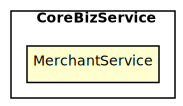
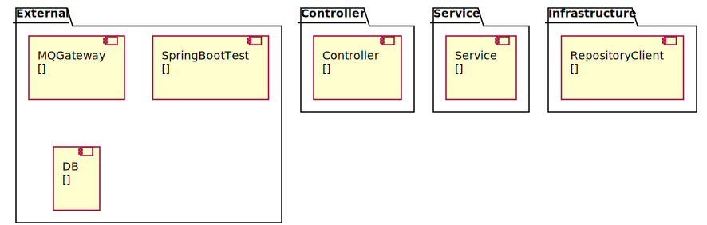

[TOC]
# Architecture Map of want2eat
##### ChangeLogs
sync 工序描述

## CoreBizService
### MerchantService
餐品订购服务: 为商家提供接入平台的服务，包括开通账号、缴纳押金、提现入账余额、收据和发票开具的功能；平台可对违反合作协议的商家进行押金扣减、入账扣减
Tech Stack: **[Spring Boot, PostgreSQL]**
 

#### 工序拆分
##### 工序 1-1 | Controller => Mock\<Service>
实现Controller获取Http请求参数，调用Service并获取ViewObject，再返回序列化的Json数据
##### 工序 1-2 | Service => Mock\<RepositoryClient>
实现Service调用Repository获取Entity / Client获取DTO，组装成ViewObject并返回
##### 工序 1-3 | RepositoryClient => Mock\<MQGateway>
实现Client使用Http调用MQ或Gateway，通过DTO映射请求和返回的Json数据
##### 工序 1-4 | RepositoryClient => Fake\<DB>
实现Repository使用JPA调用DB，通过Entity映射数据库表数据
##### 工序 1-5 | SpringBootTest => Real\<SpringBootTest>
实现多个组件在Spring环境下的功能测试，验证框架的功能：拦截器、AOP、日志、事务处理等